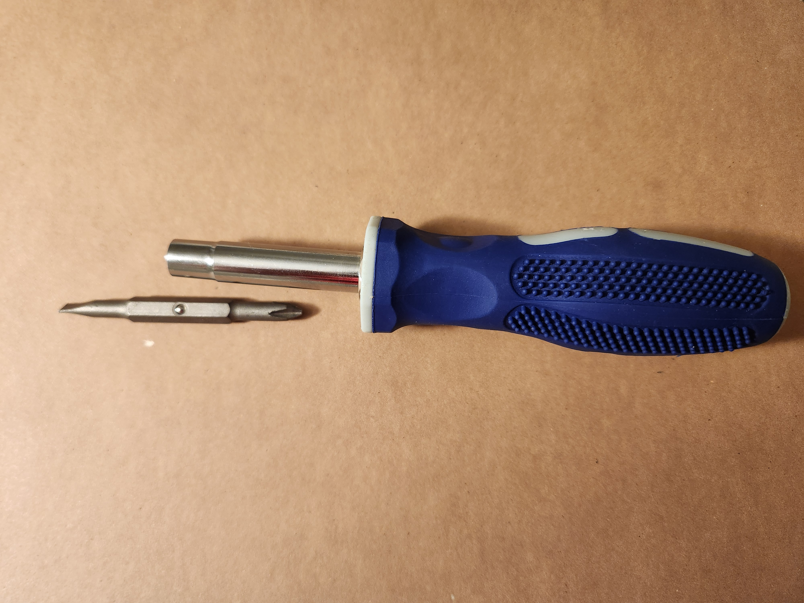
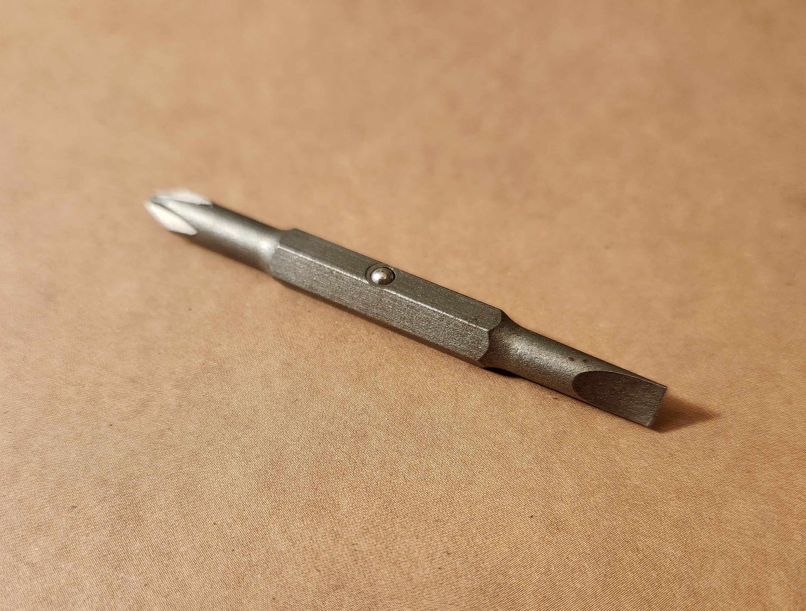
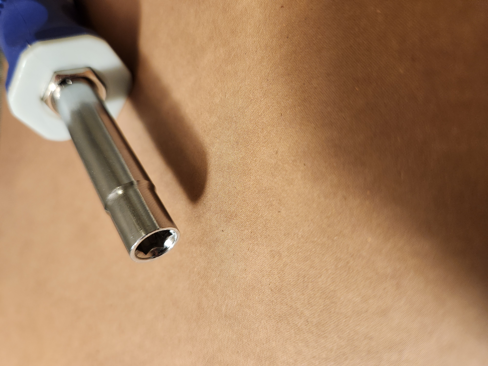
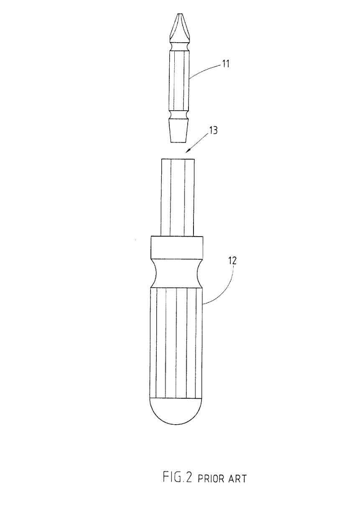
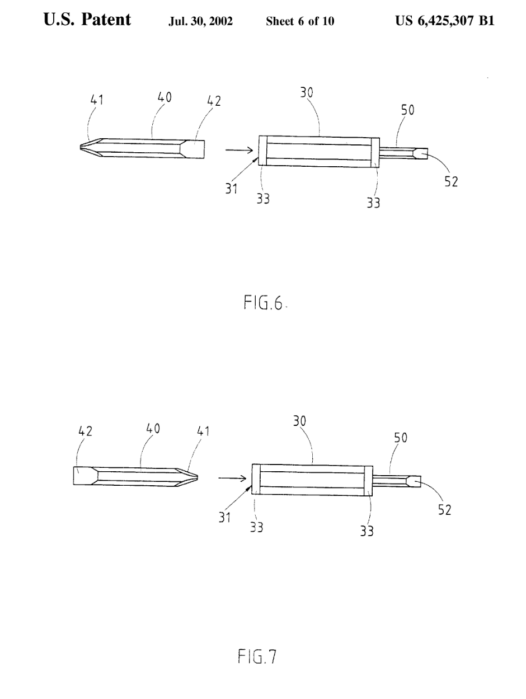
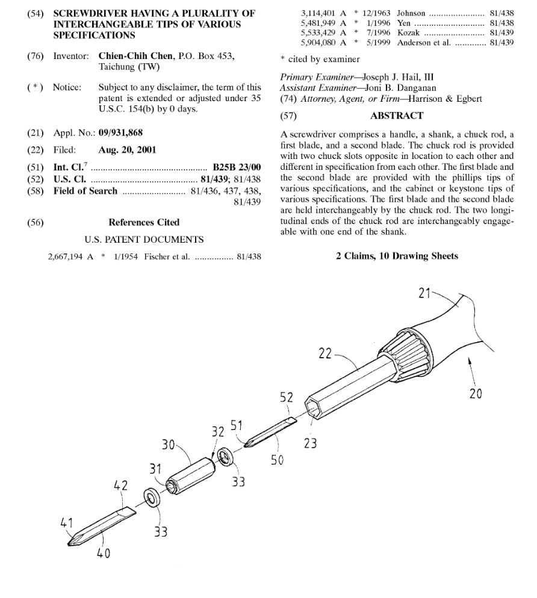

# A1 – Building a Professional Portfolio

## Objective

## Analyze

# Task A: Portfolio Analysis

**Website 1:** https://acapejones.github.io/#

The landing page for Alexander's portfolio is straight to the point. It has their name, what type of portfolio it is, what the point of the portfolio is, an avatar icon for their picture, and a menu at the bottom for what the user/employer wants to explore. When you click on one of the four menu options (About Me, Work, Profiles, and Contact), it shows a pop up of that tab with the respective information. There isn't a navigation bar on the side to access the other tabs. If you want to explore other information, you'll have to close the pop up information, and then click on one of the tabs from the homepage. That being said, any employer/user can get to the information they want to see within a minute of visiting Alexander's portfolio.

Alexander's About Me tab is very short and concise. It tells you his name, what school they attended, the level of degree obtained, and what they are looking for in the job market. There is also a little picture at the top of what looks to be a stock image of an engine. All of this information takes up two sentences.

Alexander's most lengthy section is the work tab. In this section, he goes over four of his best projects that he has been apart of. Each project has a header, what the goal of the project was, and the documentation of the design process. There are a lot of pictures and diagrams of the final product and the different components of the final design, however there is a lack of reasoning behind those pictures and diagrams. Each project will have 4-5 different pictures after each other, but there is no explanation for the design or the decision that they made along the way. Alexander's only project with further analysis than documentation was the DMG MORI Senior Design Project where the stress tests were shown. No further information was expressed pass this though. If someone were to look at each project, they would know how to build some of them, but they wouldn't know the reasoning behind it for the reasons mentioned earlier.

The last two tabs show his linked in and how you can contact him if you were wanting to hire him. 

Alexander's tone throughout the entire portfolio was professional. He addressed professional figures in a professional way. Examples would be talking about team positions and addressing the client. It is very similar to what you would read on an engineering portfolio.

**Website 2:** https://allisterjsequeira.github.io/index.html

Allister's landing page shows his own digital signature, his name, and the projects that he thought was worthy to put on his portfolio. There is a menu at the top of the screen if you're not immediately interested in his projects. The menu consists of his Projects, Resume, About page, and a Contact page. It is very organized and easy to navigate. Anyone will be able to navigate to what they want to see within a minute. 

Exploring Allister's project page, you are presented with final images of each project. When you hover over the image, it shares the name of the project and what organization he was apart of while working on the project. To explore the project deeper, you just click on the image you want to know more about. Each project has very detailed documentation of the building process and why they decided to make the decisions they did. If a colleague were to look at the documentation, it would be relatively easy to replicate the projects shown. At the bottom of each project, there is a section for the top skills applied to the project. There are also related projects that can be explored after viewing the original project you were interested in.

Allister's Resume and About pages are very professional. His resume has very little white space, and is filled with projects and experiences from college and past jobs. Each project and experience has a brief description of what he did and what he learned on the project. His About page shows two pictures of himself, one attention grabber picture (him posed in front of a lake with large mountains and endless forest behind him) and one picture showing what he's interested in (The different chassis he designed for SPCE Racing). Allister's introduction is friendly and gives a story about himself for the employer to get an idea of what he really is like. 

The tone throughout each section is fairly professional. Allister describes what he needs to quickly and clearly. There is a goal laid out for each project, no casual words are used while describing/explaining ideas, and he communicates what skills he has improved on every project he's involved with. Overall, it is a very impressive portfolio.

# Task B: Product Analysis
**Product:** Interchangeable Screw Driver

A interchangeable screw driver's primary function is to be able to drive different types of screws. This function is achieved through the two different bits that can be held in the body of the screwdriver, and the torque applied through the handle. Assuming that the correct pressure is being applied by the user to the screwdriver, the main physics concepts for the interchangeable screwdriver is torque and friction.

The equation for torque is τ = F × r × sin(θ). τ is measured as a force over a certain distance, so the units would be Newton-meters or Pounds-foot. F is a force applied to the focal point, so the units would be Newtons or Pounds. r is a distance from the focal point, so the units would be Meters or Feet. An easy way to understand this formula is by thinking the greater the force and the farther the force is away from the focal point, the larger the torque.

For interchangeable screwdrivers, the length of the handle depends on what type of job that screwdriver is supposed to do. The interchangeable screwdriver shown, is about 6 inches long, making it strong enough for the most common screws seen. The bit is a hexagonal shape in order to create the most contact force to increase torque and to keep from slipping.

Friction is relative to interchangeable screwdrivers because it is the main mechanism keeping the bit inside of the socket. Interchangeable screwdriver sockets are almost the same size as the bits, but bits are slightly smaller.  The bits have a small bump on the side to create contact with the screwdrivers socket while in place. The contact creates friction, holding the bit into place. 

Another mechanism to keep the bit in place is a small lip on the socket. The lip requires more force to get that bump over the lip. Both of these mechanisms combined, allow the bit to fit snug inside of the socket without it falling out while driving in screws.

The equation for friction is 𝐹𝑓 = 𝜇𝑁. 𝐹𝑓 is the friction force and is measured in Newtons or Pounds. 𝜇 is the coefficient of friction. In this case, static friction is being used to keep the bit in place, which has a higher coefficient than kinetic friction, allowing a more secure feel. 𝑁 is the normal force applied, which is the amount of force acting in the opposite direction of the friction force. The units for 𝑁 is Newtons or Pounds. 

The patent number for interchangeable screwdrivers is US6425307B1, and the credited inventor is Chien-Chih Chen. A simple alternative design from the screwdriver could be a classic butter knife. It fulfills the same concepts as a regular screw driver does, however it is much slower as butter knifes aren't designed to fit the exact shape of a screw. Another alternative could be pliers for the same reason as the butter knife. The only thing with pliers is that the compression of the pliers could warp the screw making it very difficult in the future to provide maintenance on that part. Design alternatives that the author talked about were blades to lock the bit in.

## Decide

## Communicate

