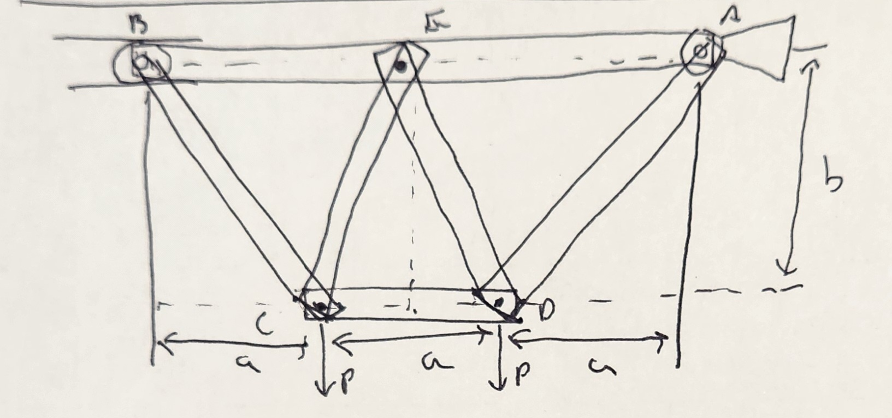
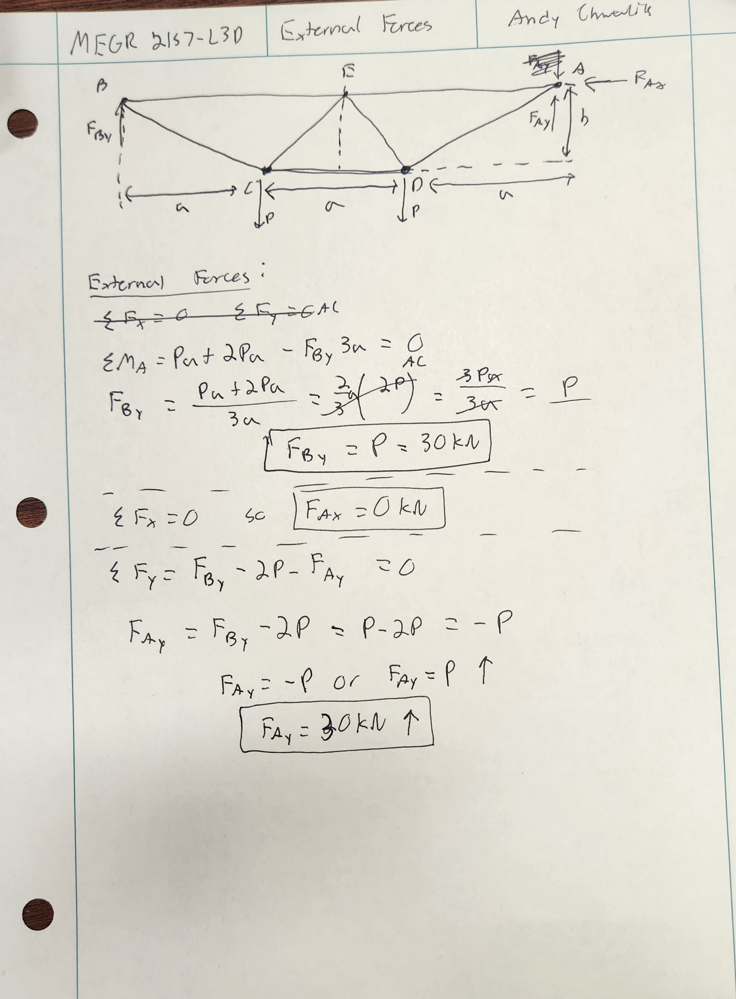
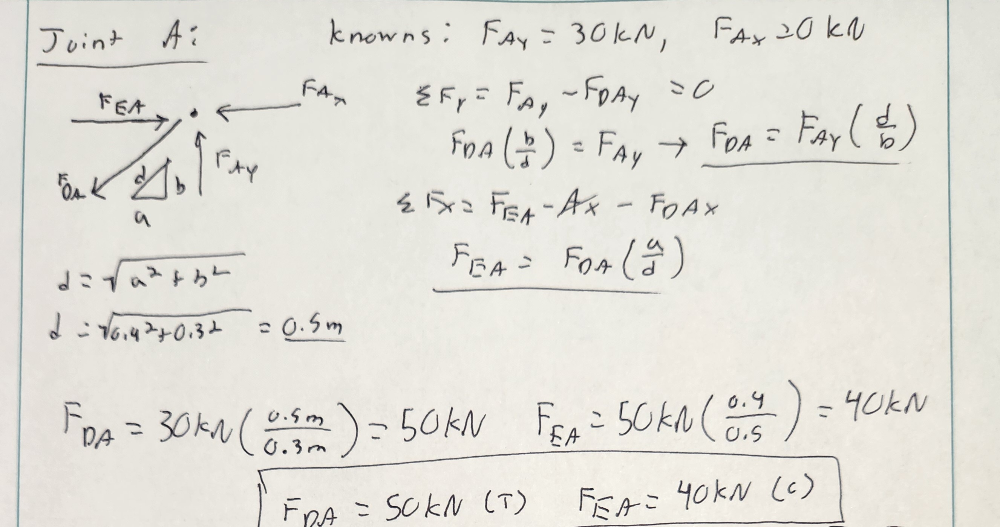
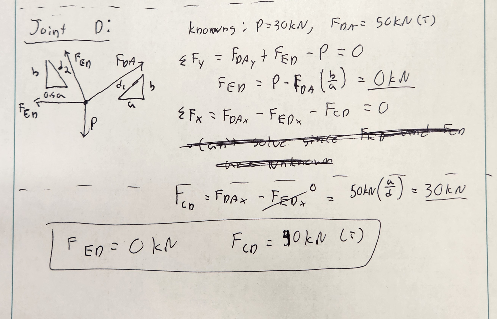
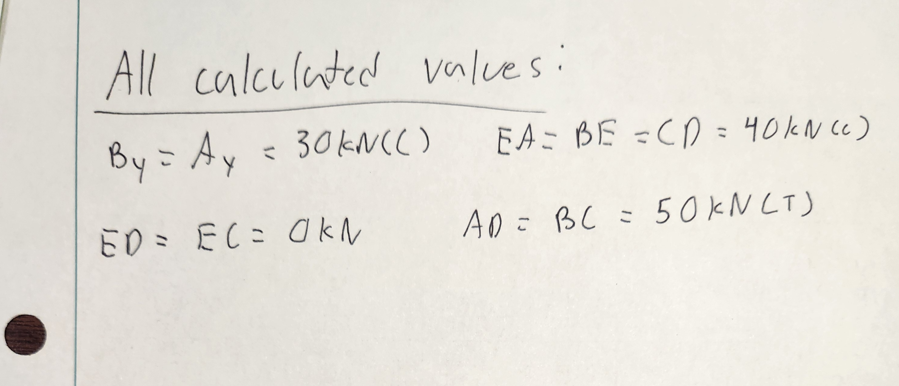
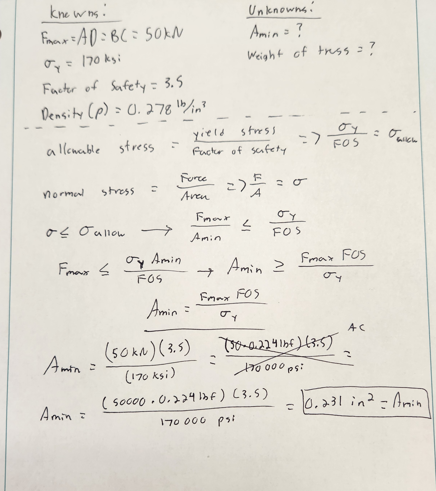
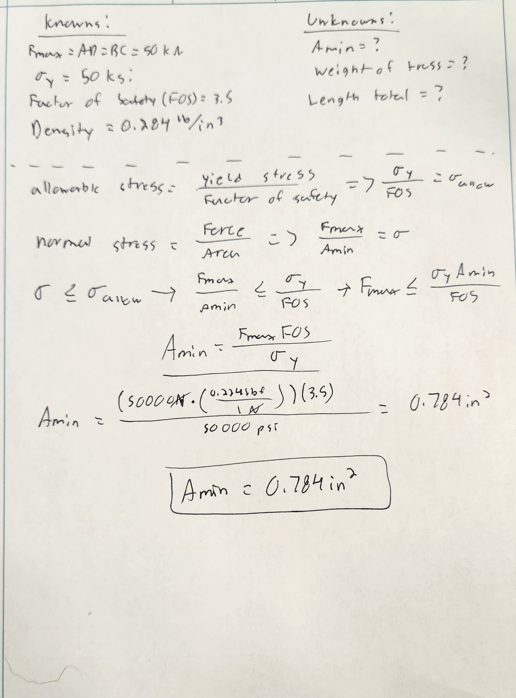
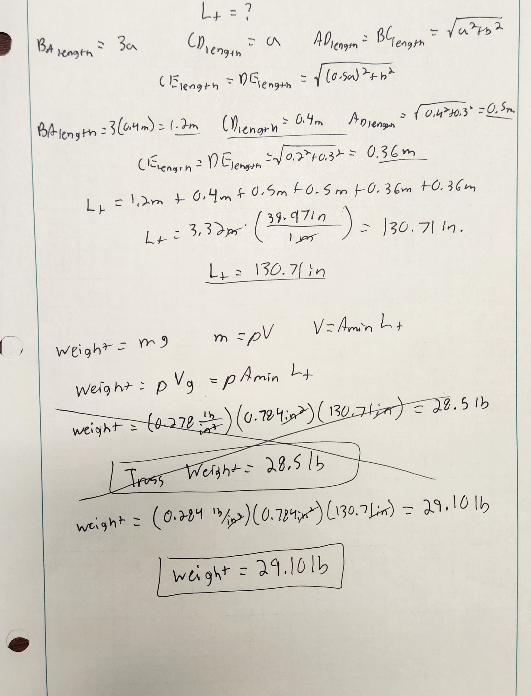

# A2 – Truss Stress Analysis

## Objective

- Design a lightweight planar truss using A500 steel or an alternative material
- Create free body diagrams (FBDs) for joints and critical pins.
- Calculate the required cross-sectional area of truss elements with a safety factor.
- Determine pin sizes based on shear forces with a safety factor.
- Solve equations symbolically and numerically for both truss and pin design.
- Estimate the total weight of the truss and pins.
- Create a CAD model with accurate dimensions and connections.
- Compare CAD weight predictions with hand calculations.
- Document key engineering lessons learned from the process.

## Analyze

  
  
<em>Figure #1.) The force and geometric constraints of the truss design problem</em>

  

Figure #1 is the absolute musts for the truss. There must be a pin support in the top right, a roller support in the top left, and two connections at the bottom with the same force acting upon them (P). P must be 20-30kN, a = 0.4m, and b = 0.3m. For my truss, I will be doing my calculations based on P being 30kN. I chose 30kN since I think it would be a good idea to design for the highest stress that could possibly be put onto my truss.

My original choice is shown in Figure #2. I wanted to connect all of the different focal points that was highlighted in the requirements. This is why I made a trapezoid like shape connecting everything on the outside. Then, my initial thought was to make the truss symmetrical to make designing more simple. I wanted to involve triangles in the design somewhere, since triangles are shown to have one of the best supports when it comes to trusses. This is why I added those two beams at point C and point D. It creates multiple support points and keeps the design nice and symmetrical.  

  
  
<em>Figure #2.) Initial thought for the truss</em>

  

## Decide

**Full Free-Body-Diagram**

To start designing the truss, I thought it was best to draw everything on paper. I drew the free body diagram for the entire truss, as shown in Figure #3. The free body diagram of the whole truss shows me what forces will be acting on the design externally. Based on my drawing, it looks like there are only vertical forces being applied to the truss due to the P force having no angle. Having everything being reliant on the vertical axis makes it very clear what the external values are: Ay = 30kN, Ax = 0kN, and By = 30kN. 

  
  
<em></em>Figure #3.) Shows the full free body diagram and the external forces.</em>

  

**Internal Forces** 

Once the external forces were found, it was time to analyze the internal forces. It didn't matter which side of the truss I started on, since the truss is symmetrical, but I decided to start at joint A as shown in Figure #4. At joint A, there were only two forces that were acting in the vertical direction. One of those forces was known, Ay, so I decided to do the sum of the y forces first. Solving the equation gave me the simple equation Fda = Ay(d/b). Now that I have the value of Fda, I can find the value of Fea since there are only two forces in the horizontal direction. Solving for Fea, I got the equation Fea = Fda(a/d). The calculated values were Fda = 50kN tension and Fea = 40kN compression.  

  
  
<em>Figure #4.) Free body diagram and internal force calculations for joint A</em>

  

I think the calculated values make sense since Fda has to be larger than Ay due to the fact that it is at an angle. The angle wasn't fully calculated out, since we knew the sides of the triangle, but I can assume that the angle is less than 45 degrees due to the fact the length of the adjacent side is longer than the length of the opposite side. Since the angle is less than 45 degrees, Fea should have a slightly larger internal force than Ay does. 

The next joint I decided to analyze was joint D because I would have all of the internal forces since the truss is symmetrical. As shown in Figure #5, there were two unknowns in the horizontal direction and only one unknown in the vertical direction. For this reason I decided to analyze the vertical forces first. I was confused while analyzing the vertical direction because after solving for Fed I get Fed = P - Fdax. Using the information from joint A, this would mean the internal force on Fed would be equal to 0kN. Once I got 0kN I thought that I messed up in my analysis and that I couldn't find Fcd. After thinking about it, I found out that ED and EC carry zero load for the truss. This means that Fcd = Fdax = Fea, which was found to be 40kN. The only change from Fea is that Fcd is in tension.  

  
  
<em>Figure #5.) Free body diagram and internal force calculations for joint B</em>

  

The values calculated make sense after finding out that Fed has no impact on the truss. There is only one force that affects Fcd, and that was already calculated in joint A.

I did draw the free body diagram and the forces for joint E, but I found out that it didn't mean anything since ED and CE have zero load on them.  The final internal force values calculated are shown in Figure #6.  

  
  
<em>Figure #6.) The final calculated internal forces</em>

  

BC, BE, and CE were all found by mirroring the already found values over the axis of symmetry.

**Cross-Sectional Area of Beams**

To find the required cross-sectional area of the beams, I need to identify the max internal force, the yield stress of the material, the factor of safety, and the density of the material. The max internal force was the AD and BC beams, which can be shown in Figure #6. There are different yield stresses for A500 steel based on the grade, so I decided to go with the most common grade: Grade C. When I first analyzed the problem, I used the shear strength rather than the yield strength, which can be seen in Figure #7. The correct yield stress and factor of safety can be seen in Figure #8.  

  
  
<em>Figure #7.) Uses incorrect yield stress variable with resulting calculations</em>

  

  
  
<em>Figure #8.) The correct variables and calculations for minimum cross-sectional area</em>

  

To calculate the required cross-sectional area, the normal stress has to be less than the allowable stress. Allowable stress is the max stress we want applied on the truss. Setting up this equation gives me 3 knowns and 1 unknown - the minimum area. With simple algebra, I rearranged the equation to solve for the minimum cross-sectional area. I made sure to convert any units that needed to be converted to make the equation work. 

**Approximate Weight of Truss**

To get an approximate weight of the truss, I needed to find the total length of material on the truss. To do this, I looked back at my free body diagram showing the whole truss. It was easy to identify the lengths of each of the beams due to the predetermined lengths of a and b. Once the total length and cross-sectional area of the beams is found, I can calculate the approximate weight of the truss. I multiplied the density of A500 steel with the volume of the material (minimum area x total length). All work and processes can be seen more clearly in Figure #9.  

  
  
<em>Figure #9.) Approximate weight of the truss</em>

  

Knowing that DE and CE have no affect on the load of the truss, I don't feel great that I just added extra weight to the truss. Those two beams added an extra 0.72m of material, which is almost a fourth of the total length. I could've saved about 6 pounds of material with no loss in performance.

## Communicate

