# A3 – Parametric and FEA

## Objective

- Use axial deflection modeling to design its dimensions
- Use parametric design to determine a bars length
- Introduce you to FEA (Finite Element Analysis)
- Introduce you to linking dimensions to appropriate parameters in CAD.
- Compare and contrast the different analysis

  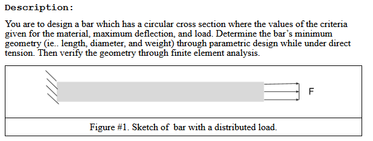

## Analyze

Starting this project, I wasn't really sure where to start. The information shown is pretty foreign to me since I haven't used much CAD software yet, and I am not taking solid mechanics currently. That being said, I used my resources the best I could, and I think I was able to create a product that is reasonable for this assignment.

### Initial Design Constraints and Model

My design process started with choosing different variables I wanted to use for my bar. There were a few variables already given: material (Aluminum), max axial deflection (0.009 in), and a range for Young's Modulus ([9.5 - 11.5] * 10^6 psi). I needed to choose a few other variables: load on the bar (lbf) and the diameter of the bar (d). I decided to choose 400 lbf because it was in the middle of the range given to us, and I decided to set the diameter of my bar to 0.25 inches for no real reason. I just thought that it would be a nice number to work with when running simulations in the future. 

  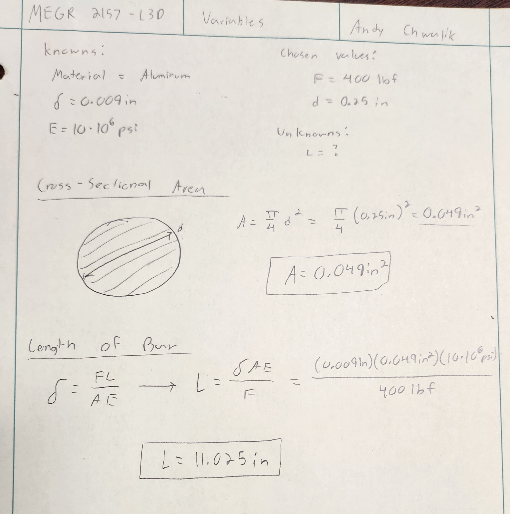

Using the above values, I was able to calculate the cross-sectional area and length of my bar using relatively simple equations that I found through the Machinery's Handbook. Now that I have all of the values I need on paper, I can head to 3D modeling/designing. 

### CAD Modeling

I decided to try out SolidWorks for this project because I have heard great things about it, and I have never used it. I have also heard that SolidWorks is pretty user friendly and good for simulating designs, so hopefully there isn't a tough learning curve.

The first thing I did when I opened SolidWorks was create a new part file and start imputing my variables that I calculated earlier. I found that this was super simple in SolidWorks due to the equations tab being apart of the model tree. I didn't put them in any specific order because I don't think it really matters when I am calling the variables directly.

  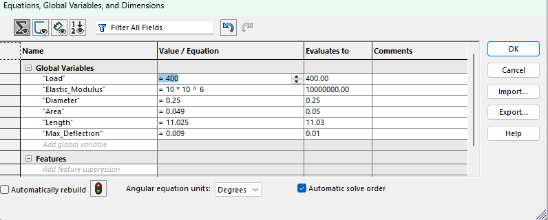

Once all of my variables were inside the equations table, I was able to start 3D modeling my bar.

<table style="width:100%;">
  <tr>
    <td style="width:60%;">
      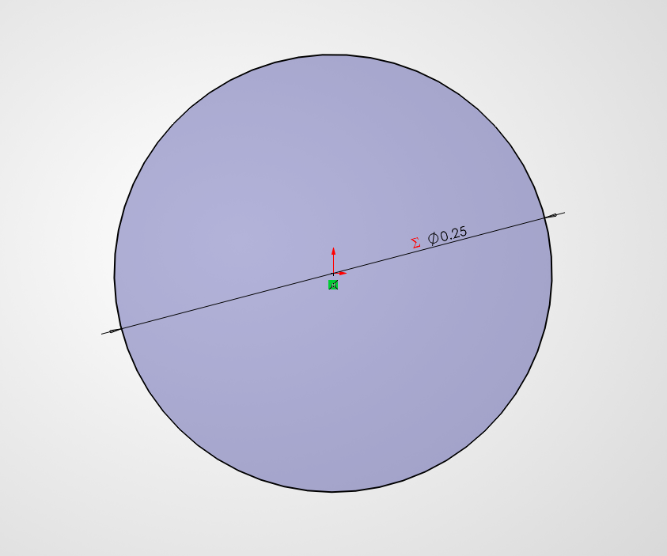
    </td>
    <td style="width:40%; padding:28px; text-align:center; vertical-align:middle;"">
      

        The first thing I did was create a circle. I made the diameter of the circle = to my diameter variable I made earlier. I also double checked to make sure my file was using US customary units because the default is metric. 
      

    </td>
  </tr>
    <tr>
    <td style="width:60%;">
      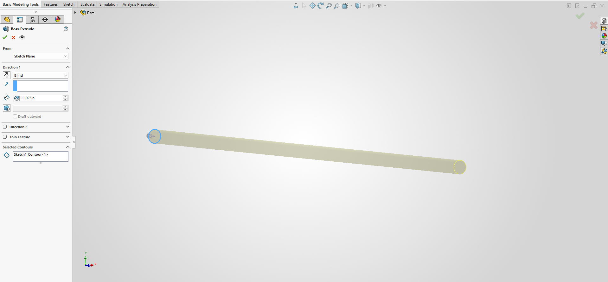
    </td>
    <td style="width:40%; padding:28px; text-align:center; vertical-align:middle;"">
      

        After the initial sketch was completed, I used the extrusion tool to extrude my sketch. I made sure that the extrusion was directly influenced by the length variable made earlier.
      

    </td>
  </tr>
    <tr>
    <td style="width:60%;">
      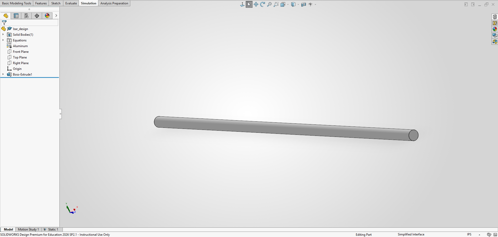
    </td>
    <td style="width:40%; padding:28px; text-align:center; vertical-align:middle;"">
      

        This is what my final bar design looks like. It is pretty long and thin, but that was expected based on the diameter that I picked. 
      

    </td>
  </tr>
</table>

### Simulating Preperation

After completing the initial 3D model, I started working towards simulating my bar. The first step was to create the aluminum material inside of SolidWorks, so I can run the simulation. I can't access MatWeb, a material property data website, due to a cookie error. I don't understand what the problem is because I made sure my cookies were enabled, I switched browsers, I switched emails, and I switched devices multiple times but nothing seemed to get the website to load. To work around this, I looked at another students material properties, and used the values that they obtained from MatWeb.

Even though I obtained the correct material properties, I had no idea how to input the material into SolidWorks because it was my first time using it. When I first entered the material library, I typed in "aluminum" to find something related to the material I am using, but nothing important came up. I didn't realize there was just a folder already made in the material library for custom materials, so I created a new material inside that library and imported the values I was given. I named this material "aluminum" for future designs/projects.

  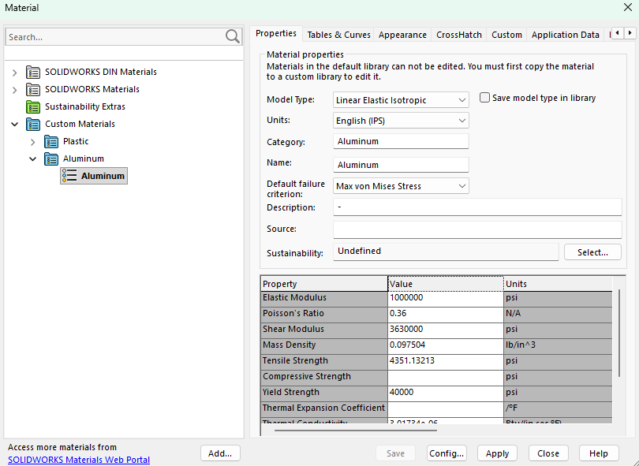

After creating the material I was using inside SolidWorks, I moved onto learning how to do FEA analysis. There is a simulation tab at the top of SolidWorks, so I clicked on that and picked the static simulation option. I chose static because we are calculating stress, and that is the option the video linked on the Canvas page picked. Inside of the static simulation, there are a few different options: connections, fixtures, external loads, mesh, and results. Since my bar isn't connected to anything, I don't have to worry about the connections option.

<table style="width:100%;">
  <tr>
    <td style="width:60%;">
      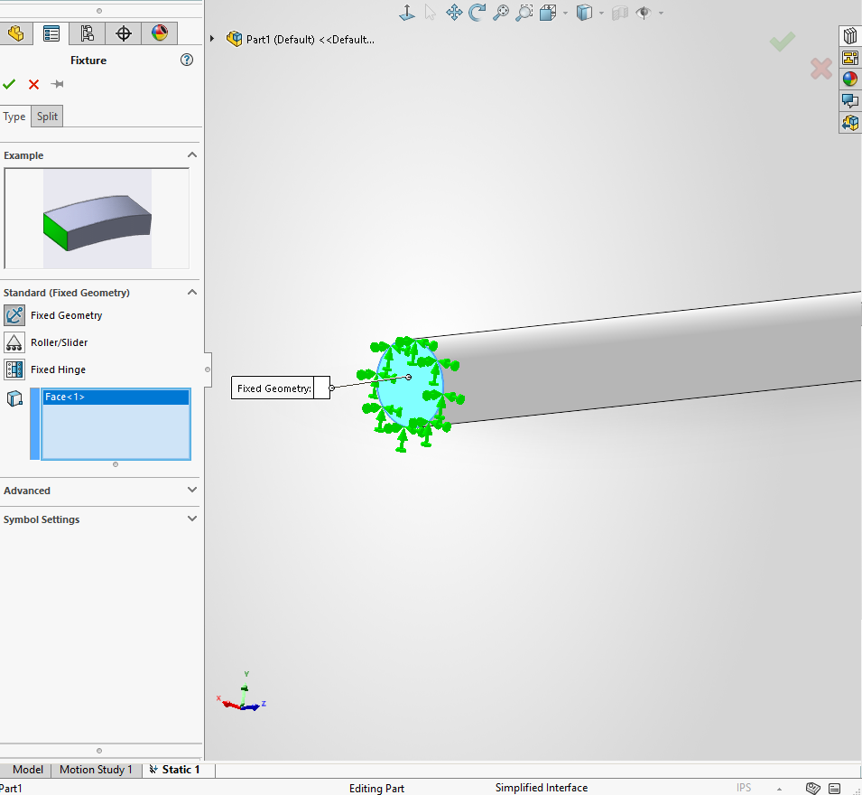
    </td>
    <td style="width:40%; padding:28px; text-align:center; vertical-align:middle;"">
      

        What a fixed point does to my object is tell the software that I don't want this part of my object to move. It is held in place for the simulation. To apply a fixed point, I right-clicked on the fixture option, and selected "Fixed Geometry". Now all I have to do is click on a face of my object that I don't want to move and click the green check mark in the top left. Since I was testing stress and deformation, I just made one end of my bar a fixed point.
      

    </td>
  </tr>
    <tr>
    <td style="width:60%;">
      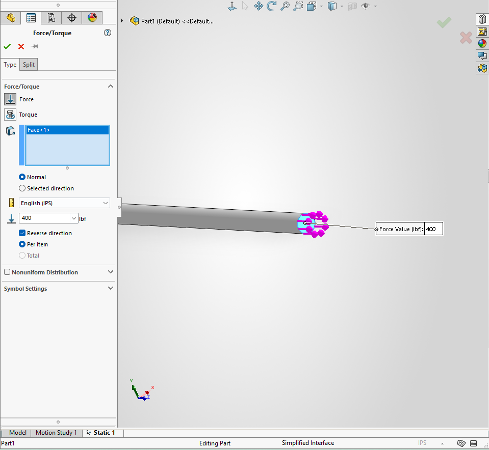
    </td>
    <td style="width:40%; padding:28px; text-align:center; vertical-align:middle;"">
      

        Now that I have a fixed point, I needed to apply a load on my object. To do this, I right-clicked the "External Loads" option and selected "Force". I was able to then click on a surface tat I wanted to apply a force/load to. I decided to apply it to the opposite end and point it in the opposite direction as the object. I made sure that the units were correct because it is in Newtons by default. 
      

    </td>
  </tr>
    <tr>
    <td style="width:60%;">
      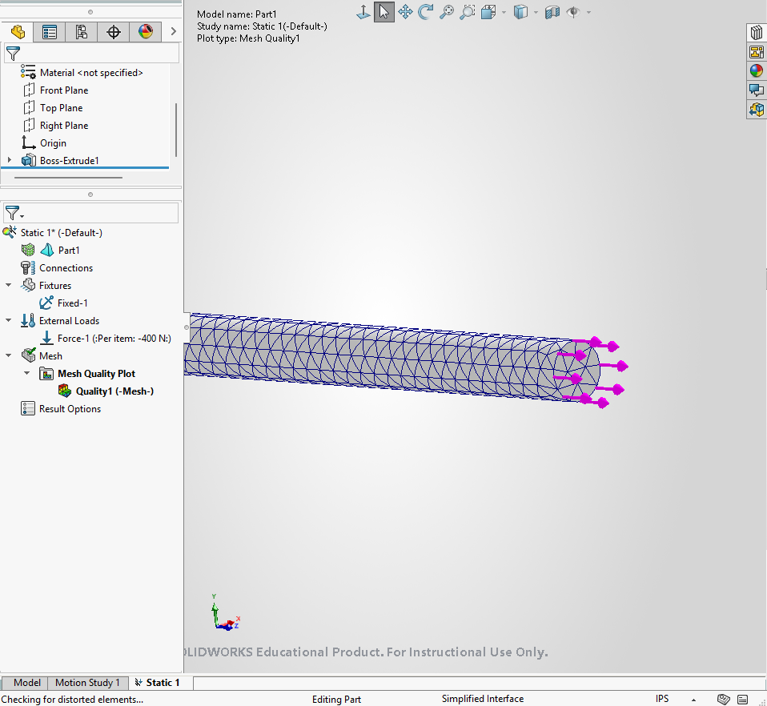
    </td>
    <td style="width:40%; padding:28px; text-align:center; vertical-align:middle;"">
      

        To see the actual stress and forces applied during the simulation, I applied a mesh to my bar. What this does is separate the the bar into miniature sections to show me the stress and deformation at those specific points. It gives a better all-around picture of what's happening. To apply the mesh, I right-clicked the mesh option and selected create mesh. I accepted the default constraints, by clicking the green check mark in the top left, and created the mesh.
      

    </td>
  </tr>
</table>

### Simulations

After all of the preparations are complete, I can move onto actually simulating my bar. There are two simulations that I need to show: A deflection map and a von Mises Stress map. A deflection map shows how much my object can bend/move without breaking. A von Mises Stress map shows the stress throughout the part. These two simulations combined are very useful as it basically tells me if my part will fail.

My main attention is going to be on the von Mises Stress map to see if my design is lower than the yield strength of aluminum. This will determine my factor of safety, and how strong my design actually is. The yield factor is 40 ksi or 40000 psi.

<table style="width:100%;">
  <tr>
    <td style="width:50%; align="center"">
      

        <b>von Mises Stress Map</b>
      

      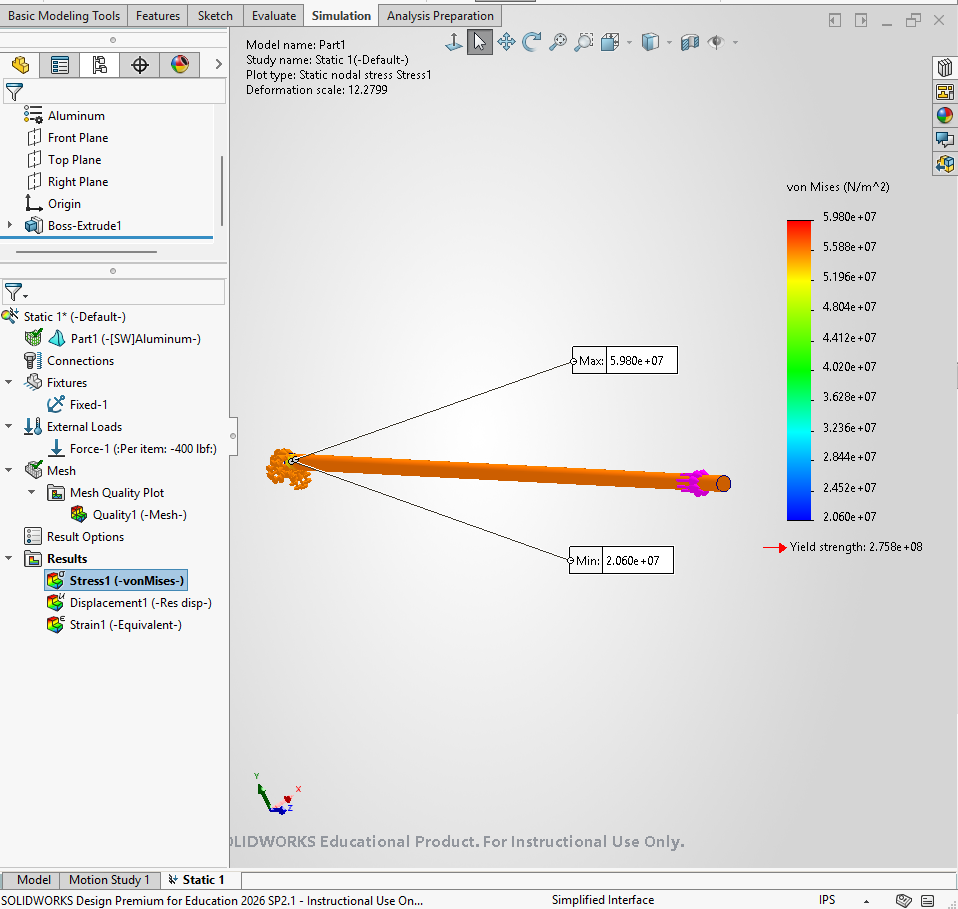
    </td>
    <td style="width:50%; align="center"">
      

        <b>Deflection Map</b>
      

      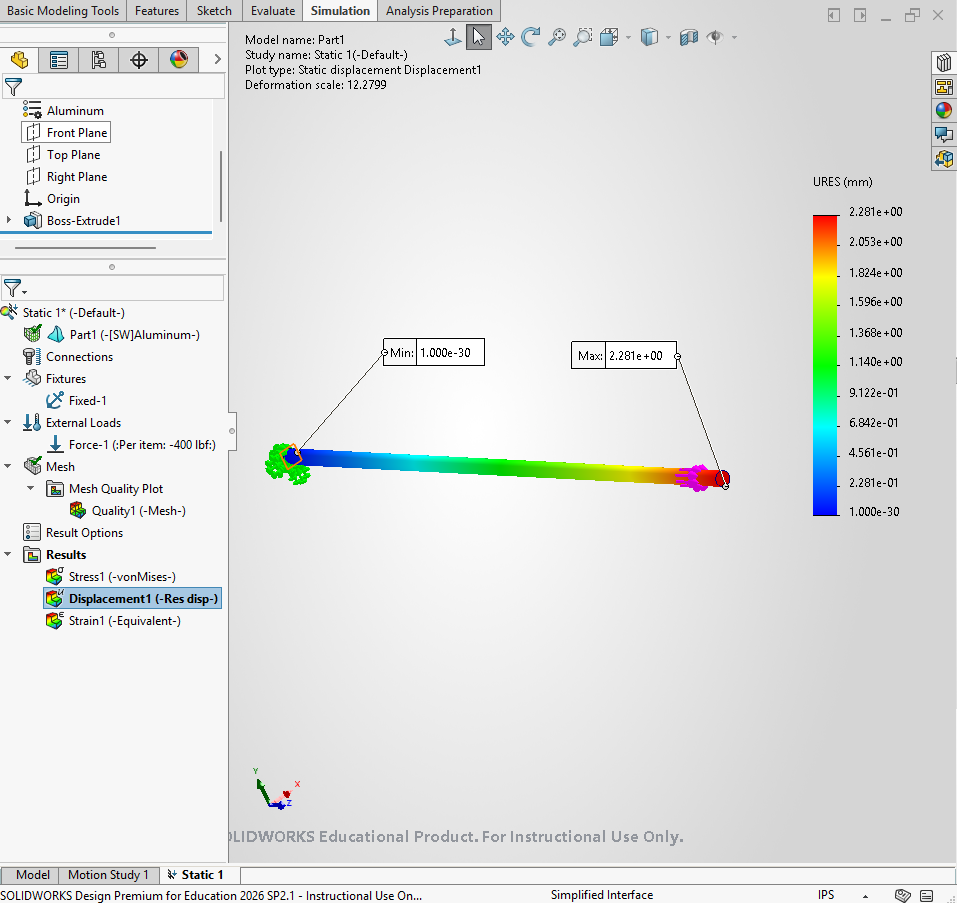
    </td>
  </tr>
  <tr>
    <td style="width:50%; padding:28px; text-align:center; vertical-align:middle;"">
      

        Looking at the von Mises Stress map, there is a pretty consistent stress over the entire bar. It looks like everything is in the range of 5.20 * 10^7 Pa and 5.60 * 10^7 Pa. My highest stress is 5.98 * 10^7 Pa. When I convert this into ksi, I get 8.67 ksi, which is well below the yield factor of aluminum. This means that my designed part satisfies the stress requirement.
      

    </td>
    <td style="width:50%; padding:28px; text-align:center; vertical-align:middle;"">
      

        Looking at the deflection map, it is pretty obvious that the closer you get to the load point, the more the bar will displace. This makes sense since that was the targeted area. It looks like my bar got displaced 2.281mm, which is over the maximum displacement of aluminum. it's not very close, so if I were finalizing this part, I would need to go back and change something so that my displacement is smaller.
      

    </td>
  </tr>
</table>

### My CAD file

Here is my CAD file for download: [Bar_Chwalik]([bar_design.SLDPRT](https://raw.githubusercontent.com/AndyChwalik/megr2157-portfolio/main/docs/assignments/A03/bar_design.SLDPRT))

### Simulation Analysis

#### Stress Calculated vs Stress Simulated

The stress that is simulated (8.67 ksi) was pretty close to my calculated stress (8.163 ksi), which is a good start. When calculating the factor of safety, I used the simulations data since it takes in account other factors. I also just trust parametric CAD software more than I probably should. When I calculated the factor of safety, I got 4.61, which is really good.

  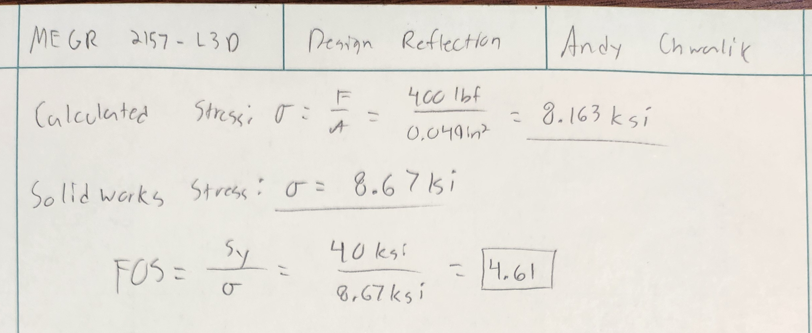

#### Max Displacement vs Simulated Displacement

Something really went wrong when simulating the deformation of my bar. I calculated an 897.78% difference between the simulated data and the max deformation allowed. Based on how the deformation is basically 10x bigger than it is supposed to be, I am assuming that one of my factors is off by a factor of 10. I was looking back through my documentation, and I am not really sure what it is right now. I am guessing that it has something to do with Young's Modulus, but it looks correctly input, so I am not sure. As of right now, I think that is the problem. I don't think that any of my designing or calculations are off, I think one number has an extra zero somewhere.

  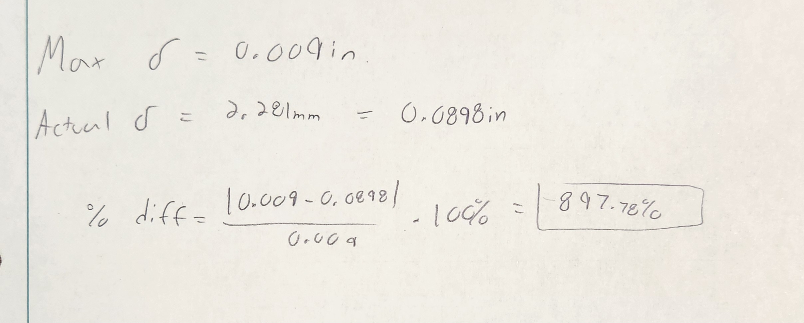

#### What If I added a hole?

If I added a hole to the currently designed beam, how would stress act differently? To test this question, I decided to make an imaginary hole that has a diameter of 0.125in. So, I have a 0.25 in bar and a 0.125in hole going through the bar. Before I calculate anything, I think that this added hole will cause higher stress levels on the sides of the bar. It is taking away a lot of the material, which is lowering the cross-sectional area, causing the stress to be higher in that area. 

To calculate the stress that is induced by this added hole, I have to find the corresponding stress concentration. Using Peterson's stress concentration chart, the corresponding stress concentration factor is about K_t = 2.16. I can use this concentration factor to multiply it with the simulated stress value to find the maximum amount of stress induced by the hole. I can then compare this max value with the yield strength and factor of safety I found previously.

  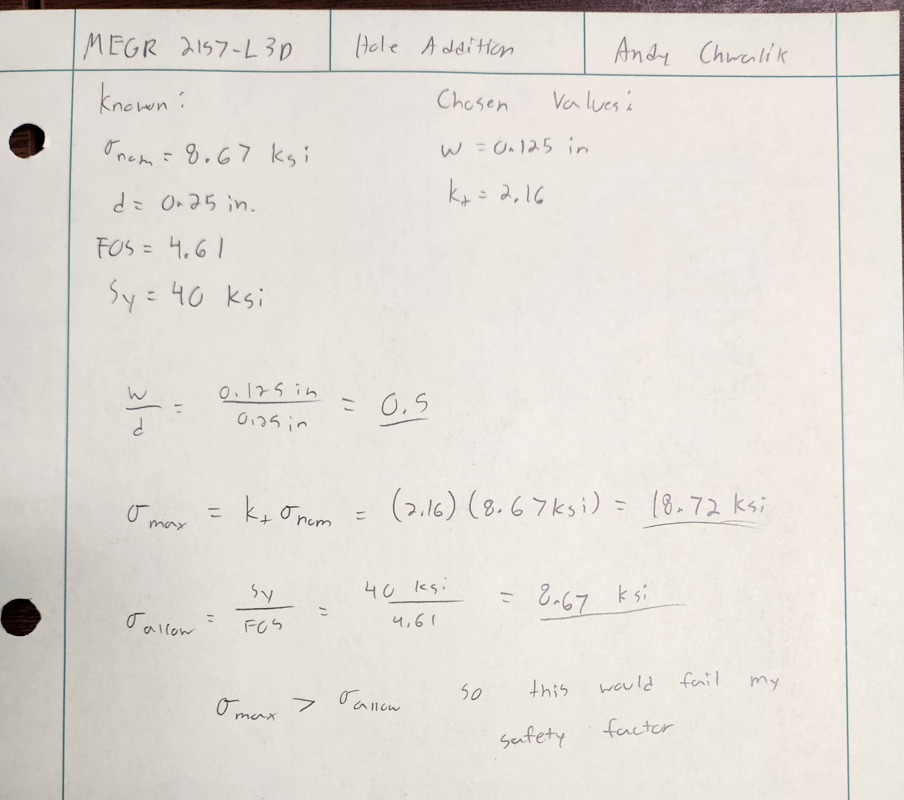

Looking at the calculations, it is pretty obvious that the stress induced by the hole surpasses my allowable stress. It is almost 10 ksi over the allowed value. 

### 2157 Students only

For this section, we were told to change each of the parameters, not including the material properties. So, this includes the load, thickness, and diameter of the bar. I am going to change the load on the bar from 400lbf to 500lbf and the diameter on the bar from 0.25in to 0.50in. 

Based on the equation to find the length of the bar, I think that the bar will become longer. If the diameter of the bar is increasing by 2x, that means the area should be increasing by 4x. So, even with the extra 100lbf, the increased cross-sectional area should increase the length of the bar.

<table style="width:100%;">
  <tr>
    <td style="width:60%;">
      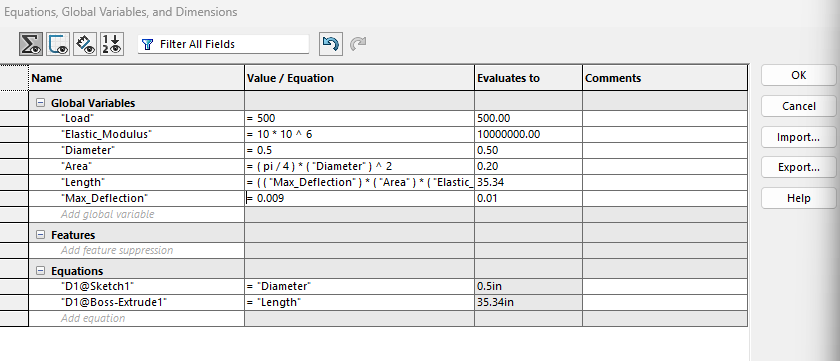
    </td>
    <td style="width:40%; padding:28px; text-align:center; vertical-align:middle;"">
      

        Looking at the changed variables inside SolidWorks, it looks like the area went from 0.049in^2 to 0.2in^2, which is very close to that 4x mark I predicted. With that increased area, the length changed from 11.025in to 35.34in. So, it looks like initial guess was correct.  
      

    </td>
  </tr>
</table>

I think it was easier to predict what was going to happen to the length of the bar because there is no width or height in a circular bar. It is just the diameter of the bar. I think if the width and height weren't the same value, it would be a little harder to predict. That being said, it is just based on cross-sectional area; so, as long as you're able to predict the area, you can get a good idea what the length of the bar should be.

## Lessons Learned

- I learned a lot about how SolidWorks actually runs. It is obviously similar to other parametric CAD software, but they seem to put highly accessed information in easy to find spots. I think it is very enjoyable to use, and I think I am going to try and use it throughout this course.
- I learned how you can adjust variables in the design phase to get vastly different shaped components. It seems like an easy way to bounce ideas around while designing crucial parts.
- I learned about the global variables inside of the CAD software. I didn't know you could just put equations in the system, and have it update automatically when something is changed. It makes the quality of life so much better.
- I learned how to simulate 3D models on SolidWorks. I learned how to apply fixed points, loads, and show different information on the charts provided by the simulations.
- I keep learning how important it is to double check your variables. I keep missing variables in every project I do no matter how many times I check over them.
- Simulations aren't perfect, but they give you a really good idea of how a part will run. Don't take simulation data as hard truth, as that can run differently in the real world. That's why there is lots of real world testing.

This assignment took me about 5 hours and 15 minutes.
