# A4 – Motor Mount

## Objective

The goal of this assignment is to design a motor mount for a Brushed 24V DC Gear Motor 3.6kg.cm/46RPM w/ 99.5:1 Planetary Gearbox. There will be two features for the mount: a cantilever beam attached to the motor and a rigid wall that can attach the mount to walls. The design should take into account that both features are capable of bending. Both features maximum allowable deflection is 0.30 mm. The mount must also be designed with 3D printing filaments such as ABS, PETG, or PLA. Doing so should teach me how to design functional parts without fully manufacturing the part.

  
   
  <em>An example of how the motor mount should function.</em>

The P variable will have a force of 300N applied to it. While designing the motor mount, I will be designing with a safety factor of 3 and neglect the weight of the motor. 

  
   
  <em>Both features are shown as a rough design for the motor mount</em>

## Analyze

### Motor Properties

Before I can start designing the features for the motor mount, I need to get a better idea of the properties of the motor I am working with. I followed the link in Canvas to the store page and scrolled down to the specifications in the listing. Based on the information given, the most important information for me will be the physical specifications. I will not be using the electrical properties, as it doesn't apply to anything I am designing for this project.

<table style="width: 100%; text-align: center; border-collapse: collapse;">
  <!-- Top two pictures -->
  <tr>
    <td style="width: 50%;">
      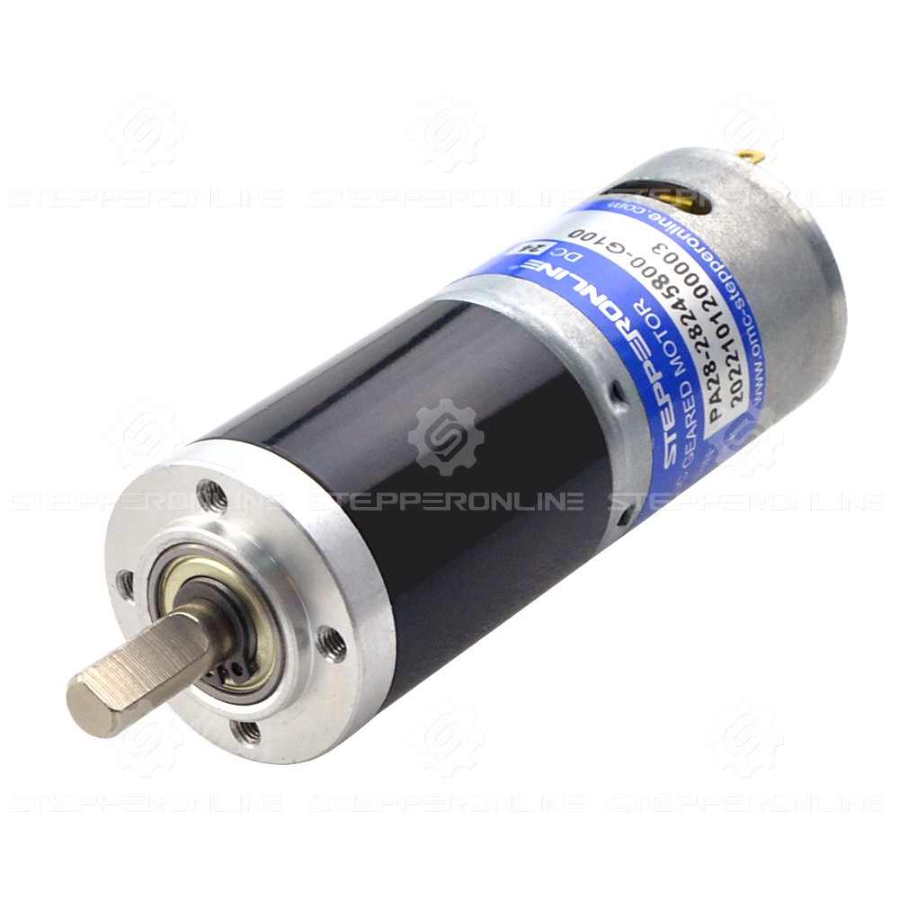
    </td>
    <td style="width: 50%;">
      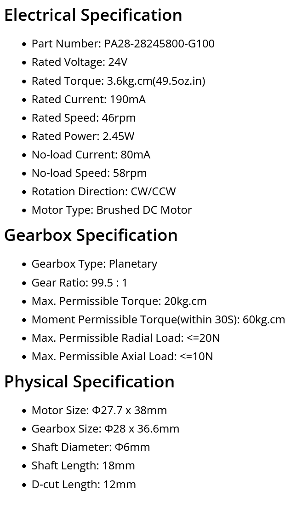
    </td>
  </tr>

  <!-- Caption underneath -->
  <tr>
    <td colspan="2" style="padding: 16px; vertical-align:middle; text-align:center;">
      <em>Motor and the specifications of it from the store page.</em>
    </td>
  </tr>

  <!-- Picture underneath -->
  <tr>
    <td colspan="2">
      
    </td>
  </tr>

  <!-- Caption underneath bottom picture -->
  <tr>
    <td colspan="2" style="padding: 16px; vertical-align:middle; text-align:center;">
      <em>Dimensions of motor</em>
    </td>
  </tr>
</table>

### Material

Out of the three filament options I could choose from, I decided to use PETG for my motor mount. PETG has high impact resistance which can prevent my mount from breaking under stress. It has a high elastic modulus, allowing me to use thinner walls, saving on material. And it has better heat resistance than PLA does if the motor, or any surrounding parts, were to exert unexpected heat.

  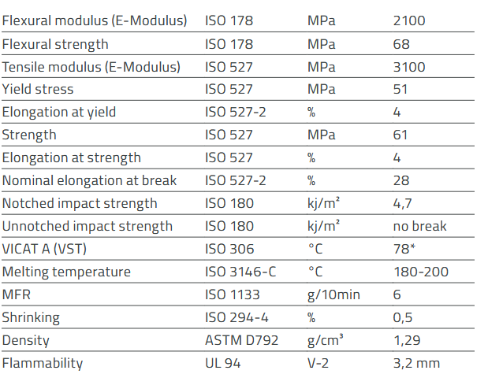
   
  <em>Here are the material properties for PETG</em>

The two notable properties for the motor mount is the elastic modulus and the yield stress. According to the table above, the elastic modulus is 2100 MPa and the yield stress is 51 MPa

### Feature 1

#### Free Body Diagram

Now that I have a good understanding of the properties of the motor and the material I want to use, I decided to move onto designing feature 1. As stated in the objective, feature 1 should be a cantilever beam that attaches to the motor. That is why I decided to model my FBD after a cantilever beam with the load attached to the motors shaft on the bottom. Since the force was going towards the fixed wall, it provides a positive moment around the beam.

  
   
  <em>Here are the material properties for PETG</em>

#### Calculations

I need to find the cross-section of this beam that will satisfy the physical requirements for the motor mount. To do so, I used the two equations that we were given in class. I wasn't sure on how to get h and b separated, so I gave h a flat value of 20mm. After h had a value, I did simple arithmetic to find the stiffness of b and the strength of b. Since I got a bigger deflection value for the stiffness, I used the stiffness of b when calculating the cross-sectional area of my beam. 

  
   
  <em>Here are the material properties for PETG</em>

Now that I have a final value for the cross-sectional area, I can move onto the designing of feature 2.

### Feature 2

#### Free Body Diagram

Since feature 1 and feature 2 are attached, the moment is transferred over to feature 2 from where they connect. Also, it is worth noting that only part of feature 2 is attached to the wall. This means some of feature 2 is susceptible to bending. To cover a majority of the motor, I used the length of the first half of the motor. It ended up being 36mm. The FBD for feature 2 was a lot simpler due to the fact I was able to reuse already found values, and there isn't an external force acting upon it.

  
   
  <em>Here are the material properties for PETG</em>

#### Calculations

I needed to find the cross-sectional area for the same reason as for feature 1. The equations were the exact same, and the process was very similar. The first time I went through it, I didn't keep the height the same as feature 1, which messed with my values since it doesn't make sense for them to be modeled at different lengths. My b_stiffness was higher than I expected, but I just assumed it was because feature 2 is a lot taller than feature 1.

  
   
  <em>Here are the material properties for PETG</em>

### Isometric Drawing

After finishing all of my calculations for feature 1 and feature 2, I created a rough drawing with everything put together. It should give me a better idea of what to expect while 3D modeling and help visualize it better.

  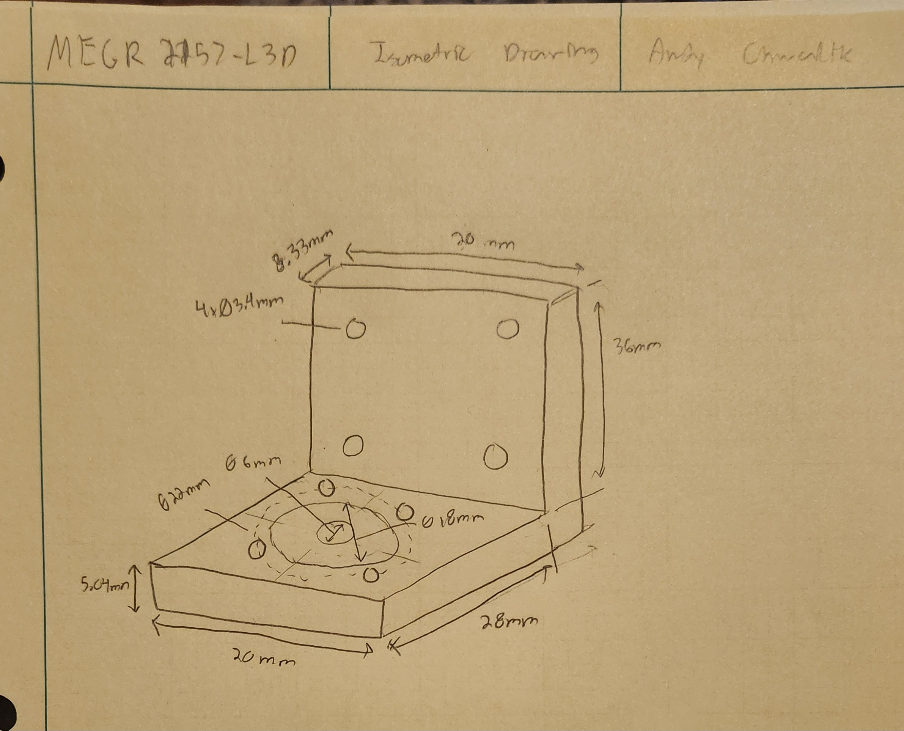
   
  <em>Here are the material properties for PETG</em>

### CAD Modeling

Before I start 3D modeling anything, I put all of my variables into the global variables feature in SolidWorks. It'll allow me to mention them directly through variable names rather than me changing the values manually. It is faster and more convenient to use.

  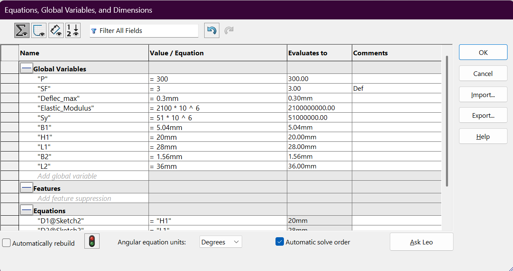
   
  <em>All of my calculated variables that I will be using for CAD Modeling</em>

<table style="width:100%;">
  <tr>
    <td style="width:60%;">
      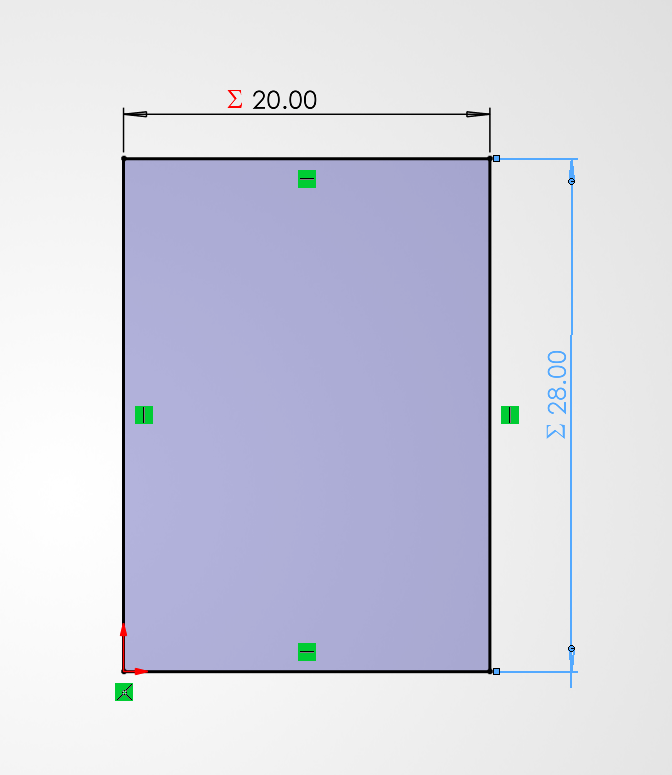
    </td>
    <td style="width:40%; padding:28px; text-align:center; vertical-align:middle;"">
      

        The first thing I did was create a box shape for feature 1. This will allow me to start working on the different components inside feature 1. I made sure to reference the correct variables.
      

    </td>
  </tr>
  <tr>
    <td style="width:60%;">
      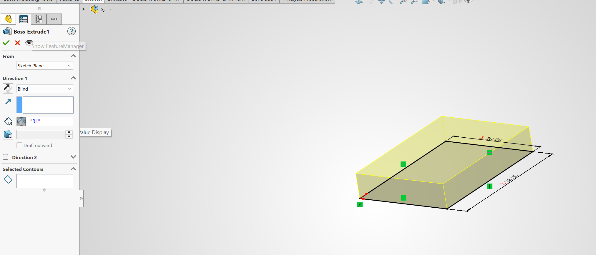
    </td>
    <td style="width:40%; padding:28px; text-align:center; vertical-align:middle;"">
      

        I extruded the sketch to my first b value from calculating since that is where I have it referenced in my isotropic sketch. I made sure to reference the correct variable
      

    </td>
  </tr>
  <tr>
    <td style="width:60%;">
      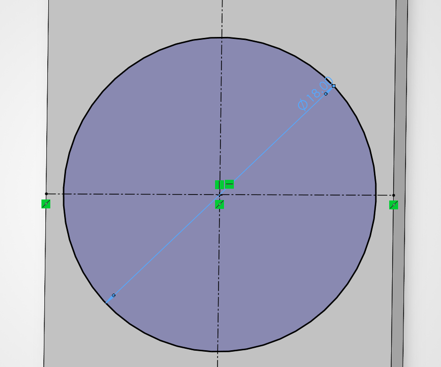
    </td>
    <td style="width:40%; padding:28px; text-align:center; vertical-align:middle;"">
      

        After, I decided to work on the indentation in feature 1 that holds the motor in place. I didn't have a global variable for this, so I just typed in the diameter manually. 
      

    </td>
  </tr>
  <tr>
    <td style="width:60%;">
      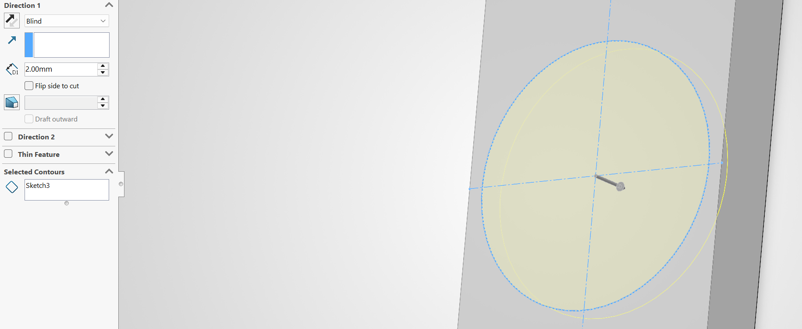
    </td>
    <td style="width:40%; padding:28px; text-align:center; vertical-align:middle;"">
      

        The indentation I made isn't the shaft. It is the little area above the shaft, so that it has a snug fit. Looking at the dimensions of the motor, it looks like this area of the motor is only 2mm long. That is why I extruded the indentation by 2mm.
      

    </td>
  </tr>
  <tr>
    <td style="width:60%;">
      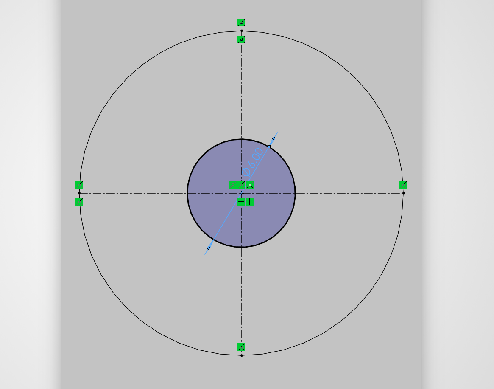
    </td>
    <td style="width:40%; padding:28px; text-align:center; vertical-align:middle;"">
      

        Once I had the indentation, I could make the shaft hole, which laid in the middle of the indentation. So I created a sketch on the recently made extrusion, and created a 6mm diameter circle in the middle.
      

    </td>
  </tr>
  <tr>
    <td style="width:60%;">
      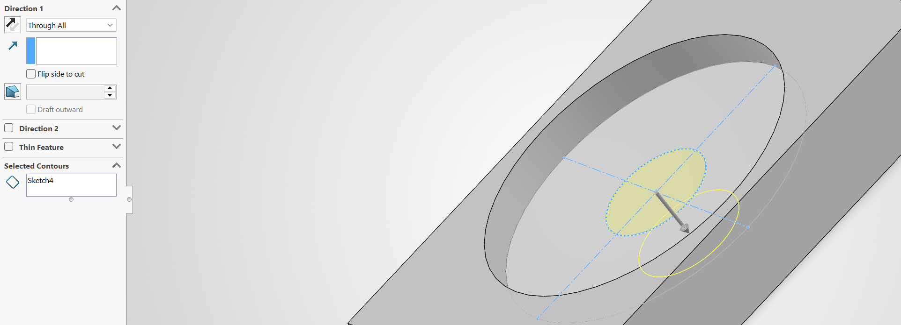
    </td>
    <td style="width:40%; padding:28px; text-align:center; vertical-align:middle;"">
      

        When the sketch for the shaft was completed, I extruded it all the way through feature 1, since I am expecting the shaft to stick out the bottom of my motor mount. 
      

    </td>
  </tr>
  <tr>
    <td style="width:60%;">
      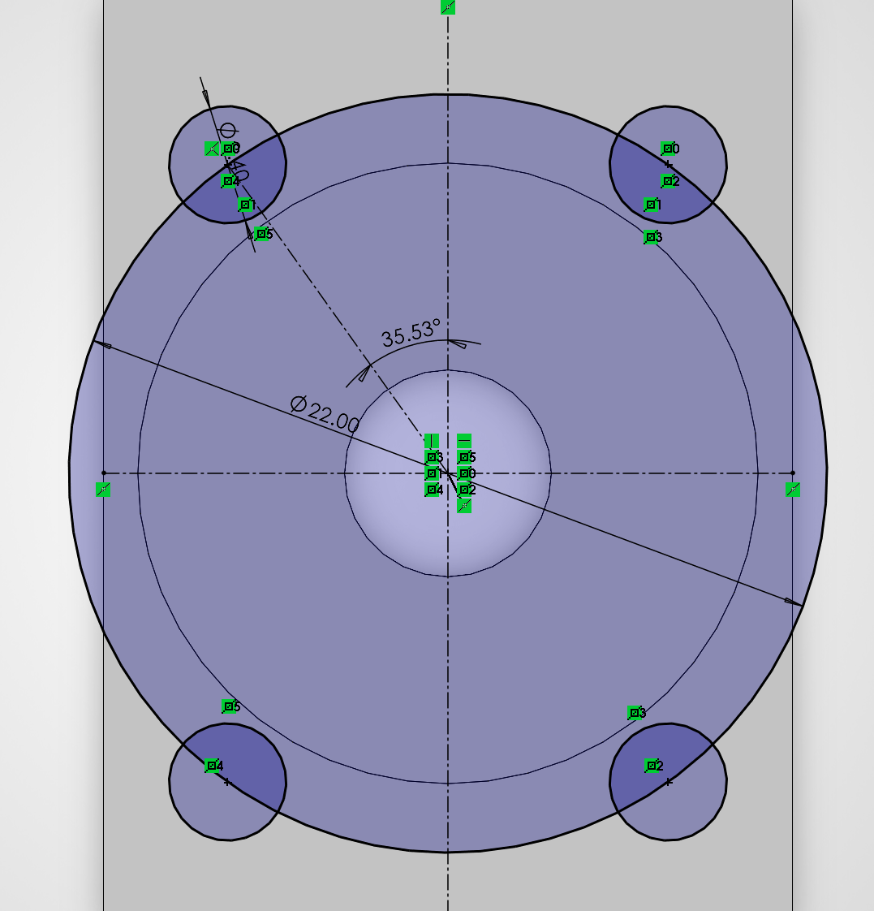
    </td>
    <td style="width:40%; padding:28px; text-align:center; vertical-align:middle;"">
      

        I moved onto the screw holes. To do this, I created another circle on the face of feature 1 with the diameter of 22mm. It is 22mm because that is what the dimensions say for the motor. I then created a centerline from the middle to the edge of the circle. Using Pythagorean theorem, where L1 is the adjacent value and H1 is the opposite value, I was able to get an angle between the centerline I created and the middle of feature 1. Using this, I had an accurate spot where I could create my screw hole. Rather than doing the whole process again, I mirrored the screw holes over the 2 major axis, so I had all 4 screw holes.
      

    </td>
  </tr>
  <tr>
    <td style="width:60%;">
      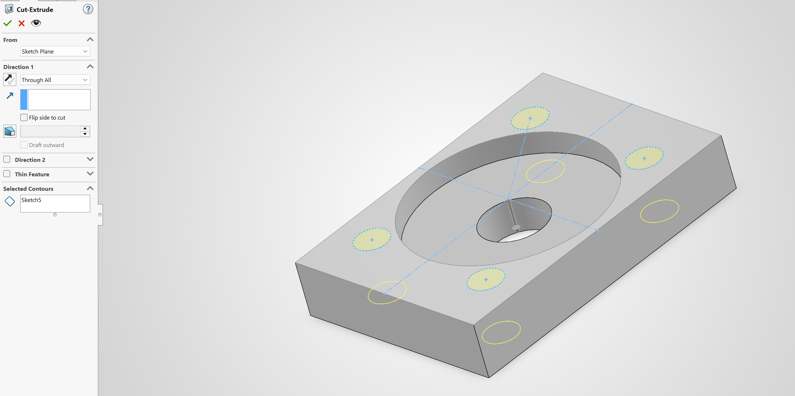
    </td>
    <td style="width:40%; padding:28px; text-align:center; vertical-align:middle;"">
      

        I can't extrude this sketch yet, so I deleted the 22mm diameter circle to leave me with just the screw holes. Now I can extrude the screw holes through the entirety of feature 1, completing feature 1.
      

    </td>
  </tr>
  <tr>
    <td style="width:60%;">
      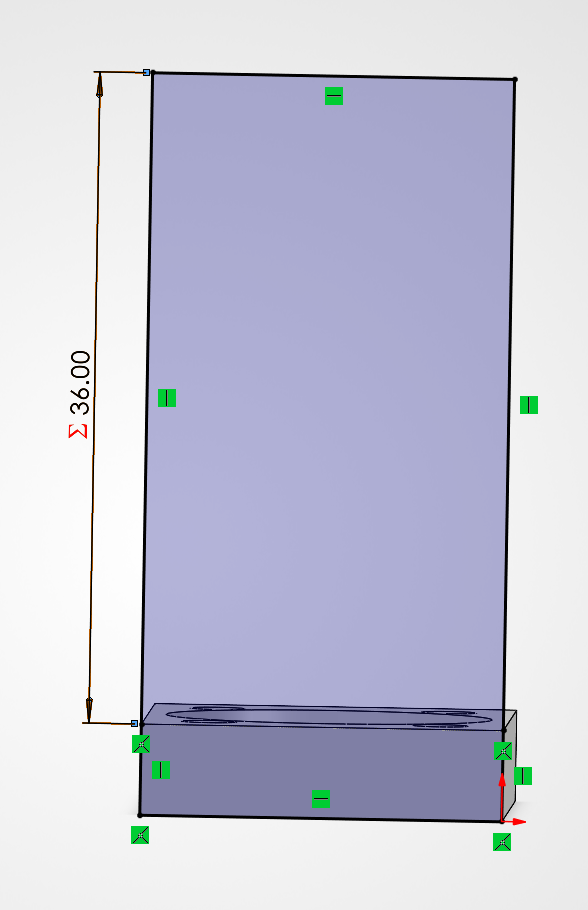
    </td>
    <td style="width:40%; padding:28px; text-align:center; vertical-align:middle;"">
      

        Moving onto feature 2, I didn't start the length at the bottom of the artifact because I designed it to match the first half of the motor. If I started it at the bottom, it would've been a little short for what I am expecting. So, I measured the length from the top of feature 1 to keep my design consistent. I made sure to reference my variables
      

    </td>
  </tr>
  <tr>
    <td style="width:60%;">
      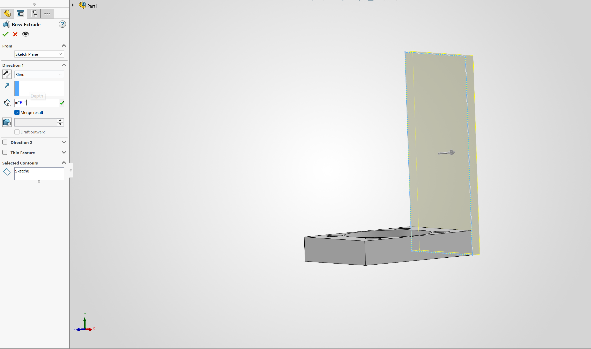
    </td>
    <td style="width:40%; padding:28px; text-align:center; vertical-align:middle;"">
      

        After creating my sketch, I extruded feature 2 to the same value as my calculated b value (B2).
      

    </td>
  </tr>
  <tr>
    <td style="width:60%;">
      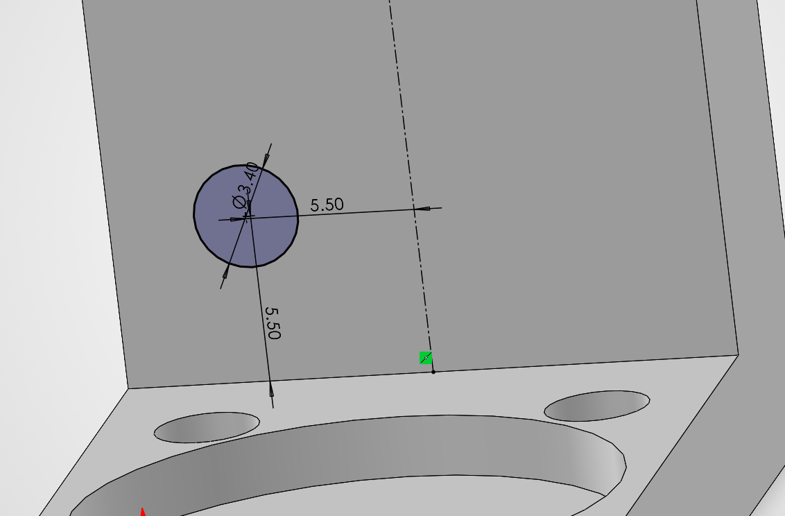
    </td>
    <td style="width:40%; padding:28px; text-align:center; vertical-align:middle;"">
      

        When I extruded feature 2, I wasn't really sure where the screw holes go on it, so I decided to just dimension it 5.50mm away from the center line of feature 2 and the top of feature 1. 
      

    </td>
  </tr>
  <tr>
    <td style="width:60%;">
      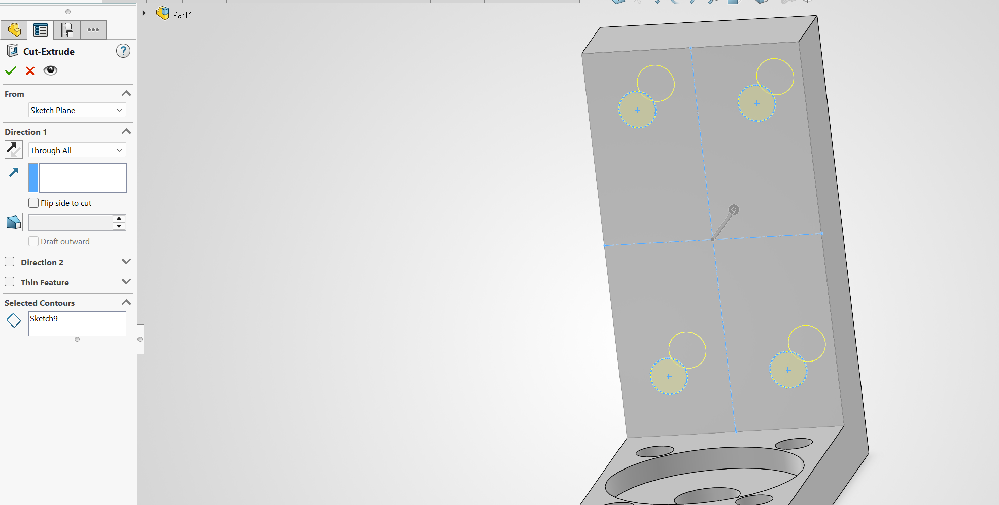
    </td>
    <td style="width:40%; padding:28px; text-align:center; vertical-align:middle;"">
      

        Having one screw hole down allowed me to mirror them across the centerlines so that everything had the same dimensions without spending a lot of time double checking. Once I had them all in place, I could extrude them all the way through feature 2.
      

    </td>
  </tr>
  <tr>
    <td style="width:60%;">
      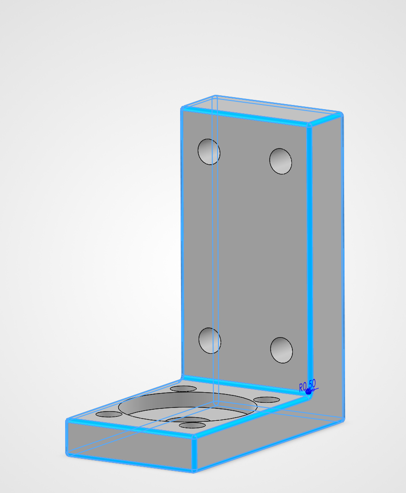
    </td>
    <td style="width:40%; padding:28px; text-align:center; vertical-align:middle;"">
      

        Everything that I have designed on paper is fully 3D modeled, but I decided to add a 1mm fillet around the entire mount. I saw that sharp edges can cause focused stress points, so I wanted to reduce the chances of that happening. 
      

    </td>
  </tr>
  <tr>
    <td style="width:60%;">
      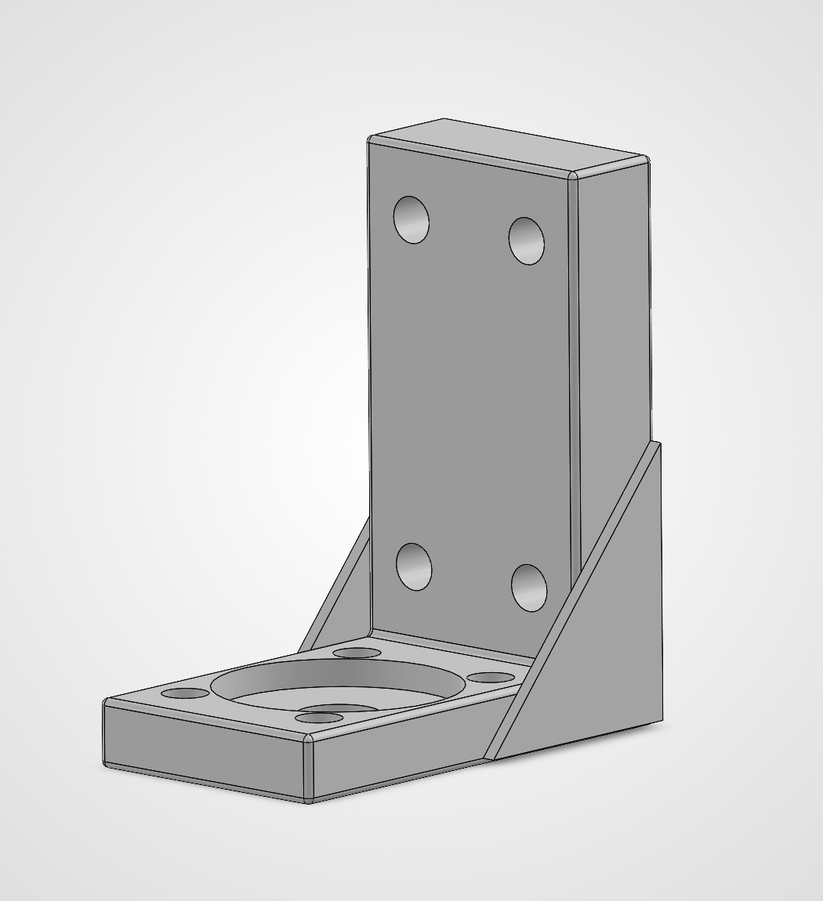
    </td>
    <td style="width:40%; padding:28px; text-align:center; vertical-align:middle;"">
      

        To add to my design, I also decided to create these triangle supports on the sides. I was thinking that it would stop my motor mount from deflecting even more, increasing the strength of my design. I didn't round the edges of the supports because I wasn't sure how much of an affect it would have for that part of the design.
      

    </td>
  </tr>
</table>

### 2157 Students Only - CAD Drawing

The 2157 students assignment is to create a drawing from the CAD model I just created. To do that, I clicked new, and then drawing at the top of SolidWorks. I then imported my part file, and placed the different views down onto the drawing sheet. To get the dimensions of my parts, I used the model items tool in annotations. This tool shows dimensions that you created inside of the part file. I thought it would be pretty useful for not over dimensioning. To change the title block I right clicked Sheet Format1 and typed in what I wanted to change.

  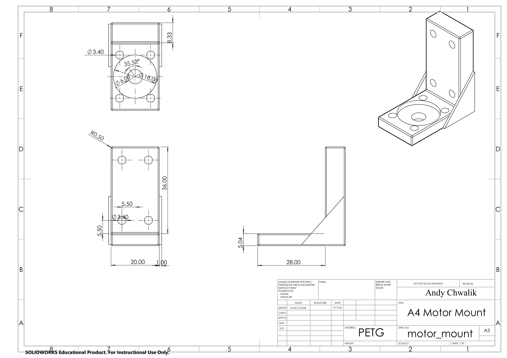
   
  <em>My completed CAD file in a drawing sheet</em>

#### My CAD Files

[Motor_Mount_Part](motor_mount.SLDPRT)  |  [Motor_Mount_Drawing](motor_mount.SLDDRW)  |  [Motor_Mount_PDF](motor_mount.pdf)

## Lessons Learned

- I learned about the different geometry that goes into mounts. I had to redo my calculations multiple times because I kept over complicating the calculations. I also didn't relate how some dimensions would be tied together. In hind sight, I should've made them equal to the larger value to minimize fails
- I am still learning how to use SolidWorks. I wasn't sure how to make a centerline because it is it's own tool in Creo. I used a lot of centerlines while making my CAD file
- I learned how to use the drawing feature in SolidWorks. I accidentally deleted my drawing file twice because I was having issues editing the title block.
- Always save your work periodically. There were a few times where SolidWorks just crashed, and I lost all of my progress because I didn't save recently. I was able to get back to where I was quickly, because I remember what I did, but it is unnecessary if I already did the work.
- How to use the moment of inertia equations with bending and mechanical properties of materials
- How to design a real part with any type of material I want to use. I always thought CAD used some type of metal for some reason.

## Resources
- https://3d.nice-cdn.com/upload/file/petg-TDS-en.pdf
- https://lairdplastics.com/resources/petg-plastic-properties-uses-amp-advantages-2025-update/

This assignment took me about 7 and half hours.
