# A5 – Bracket Design

## Objective

- Conduct stress analysis to determine dimensions for structural features
- Generate free body diagrams (FBDs) to visualize forces and constraints for each feature
- Identify and document known and unknown variables, assumptions, and algebraic models for stress calculations
- Perform stiffness analysis to establish minimum required dimensions based on deflection constraints
- Compare stress and stiffness analyses to ensure structural integrity and compliance with given constraints
- Create detailed multiview sketches illustrating dimensions derived from both stress and stiffness analyses
- Reflect on and document key engineering lessons learned throughout the process

## Analyze

### Introduction

For this assignment, I have to design a fit for the figure below when a horizontal force is applied symmetrically. The design must use a safety factor of 4 and have an applied load between 500lbf and 800lbf. The material must be aluminum 6061 T6, Steel (ASTM A36), or Titanium (Ti-6A1-V4).

<table style="width:100%;">
  <tr>
    <td style="width:50%; text-align: center; vertical-align:middle;">
      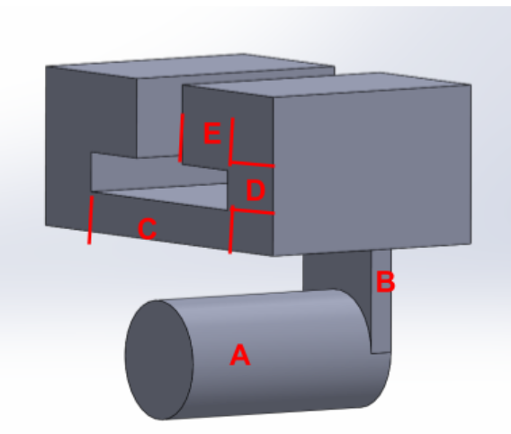
       
  <em>Figure #1: This is the part I am designing a fit for. Each of the features I am designing are constrained in the image as well.</em>
    </td>
     <td style="width:50%; text-align: center; vertical-align:middle;">
       
        
  <em>Figure #2: This is the force that will be applied to the figure.</em>
    </td>
  </tr>
</table>

I like taking the middle values of the ranges I am given, so I will be using an applied force of 650lbf. I am also not sure what material I should use, but I feel like steel will be pretty reliable. That means I will be using steel ASTM A36 since that is the only allowed steel for this assignment. Important mechanical properties I am using from steel ASTM A36 is the modulus of elasticity is 29000000psi and the yield strength is 36000psi.

### Stresses

The first task in the assignment was to do a stress analysis for each of the components. It recommended to start from feature A, and then work my way up the figure, so that is what I did.

**Disclaimer:** Most, if not all of my dimensions are incorrect. When I was trying to figure out the length of feature A, I assumed that I had to use the t-bar values that were given in figure #2. I later found out that it has no association to the length of feature A, which meant I just made up a random value for the length of feature A. This pattern continued for the later features as well. I was just super lost on what dimensions it was actually talking about it. That being said, the equations, calculations, and drawings should still be correct.

#### Feature A

First, I listed all of my knowns, unknowns, and assumptions for feature A. Listing out everything helps me pick and choose equations that I can use to help solve the problem.

    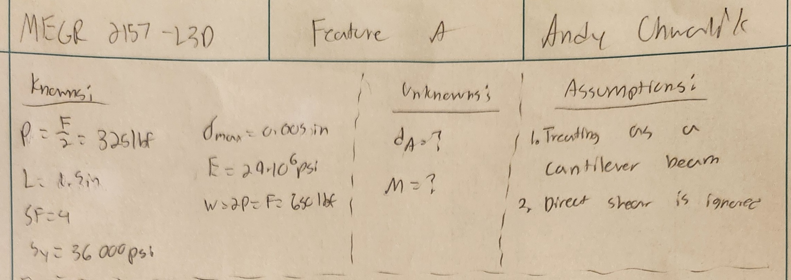
   
  <em>Figure #3: knowns and unknowns for feature A.</em>

The second step that I did for every single feature, was draw a free-body-diagram (FBD). This would help see the dimensions visually.

    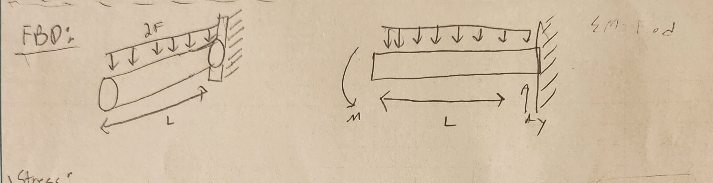
   
   <em>Figure #4: FBD for feature A</em>

When I was first solving this problem, I used the formula stress = (Mc)/I equation from the previous assignment. Although it worked, there was another method that was suggested. The other method was to find the section moduli for the beam, and then use the section moduli to find radius. Once I had radius, I could solve for the diameter of the beam. This method is shown in Figure #5. Doing both ways gave me the exact same diameter, which I found interesting to see.

    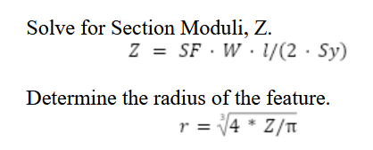
   <em>Figure #5: Equations to find the radius for a cantilever beam.</em>

Below is the comparison between the two different methods. 

<table style="width:100%;">
  <tr>
    <td style="width:50%; text-align: center; vertical-align:middle;">
      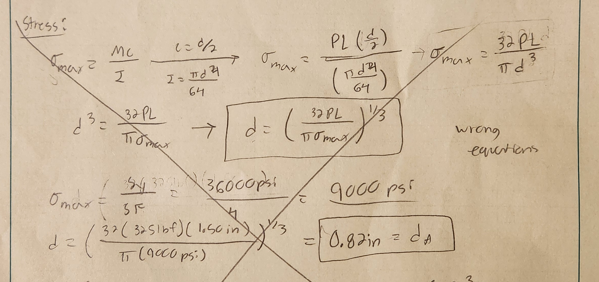
       
  <em>Figure #6: First way I thought about solving the problem</em>
    </td>
     <td style="width:50%; text-align: center; vertical-align:middle;">
       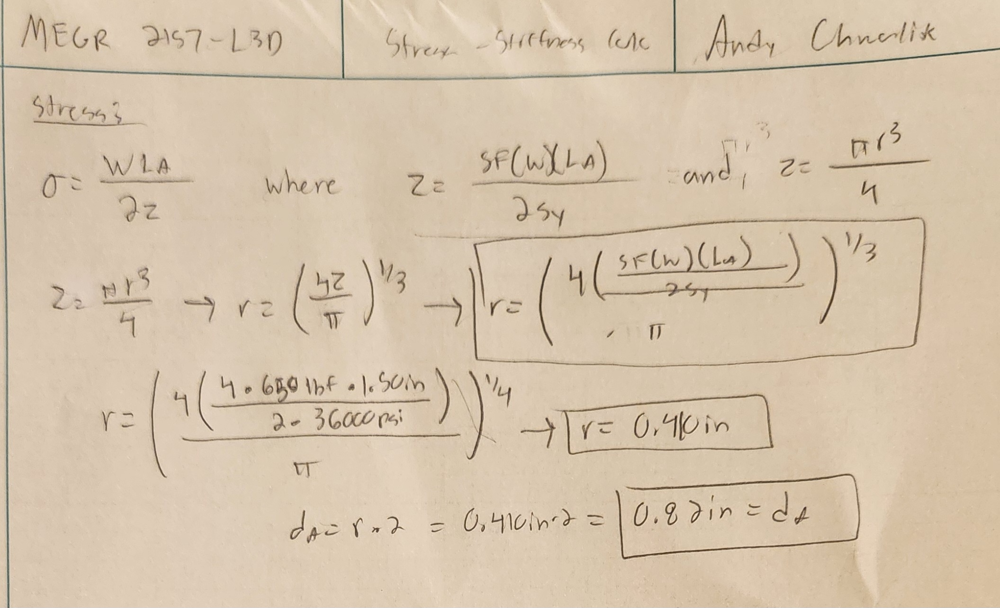
        
  <em>Figure #7: Calculations using the section moduli method. </em>
    </td>
  </tr>
</table>

#### Feature B

I started feature B the same way I stared feature A: listing knowns and unknowns followed by drawing the FBD. So I don't have to say it every time, I did this for every single feature for both stress and stiffness. The assignment says to treate feature B as an axial loaded bar.

    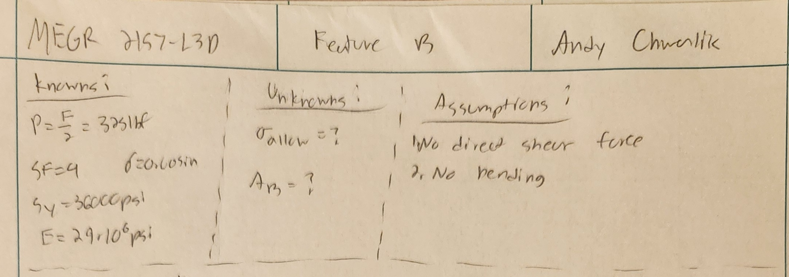
   
   <em>Figure #8: Knowns and unknowns for feature B.</em>

    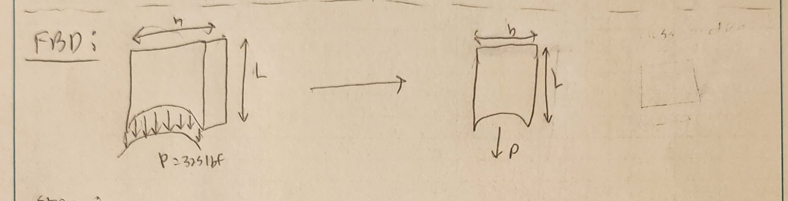
   
   <em>Figure #8: FBD for feature B.</em>

The only big value that is missing from feature B is the cross-sectional area. Luckily this is a simple equation when doing stress analysis. When I am later evaluating for the thickness of B, I can use the diameter I found from feature A to divide the total area I found. I didn't do it for this step, but the final value is shown in the detailed drawings.

    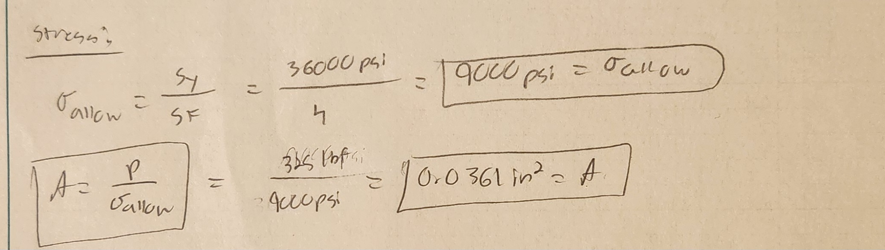
   
   <em>Figure #9: Calculations to find the area of B using stress analysis.</em>

#### Feature C

In the assignment, we were told that feature C was a supported beam with a concentrated load in the center of the beam. This was useful information when drawing the FBD.

    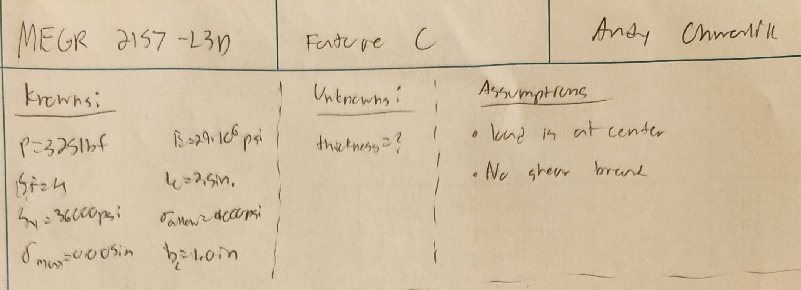
   
   <em>Figure #10: knowns and unknowns for feature C.</em>

    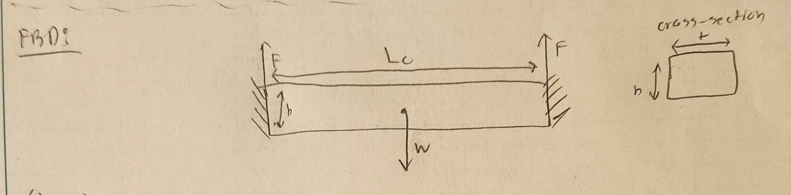
   
   <em>Figure #11: FBD for feature C.</em>

The way I got all of my known length values was through the T-beam values. I thought that the length of C was all of those values added together, which is why I got a rough estimate of 2.5in. I also used the value of b for the height of feature C, although if I was basing this on the T-beam values, I should've assigned it to c. I made b = 1.0in because I saw a b value in the T-beam figure, and thought the correlated because of that. 

    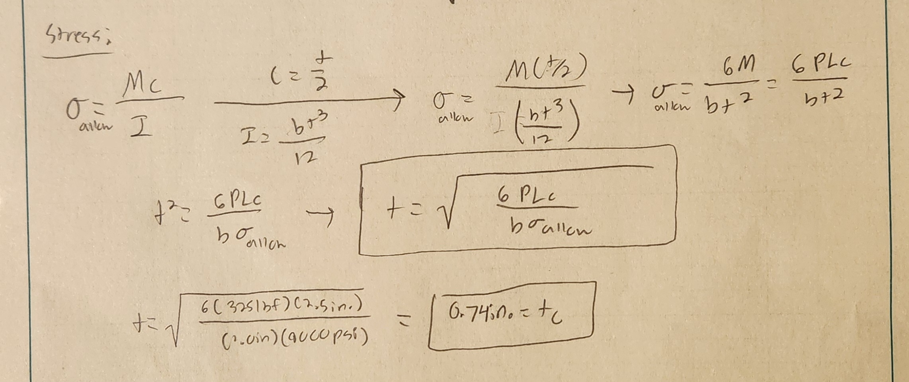
   
   <em>Figure #12: Feature C stress analysis.</em>

#### Feature D

There was no hints for feature D, so I just drew it as I saw it in Figure #1.

    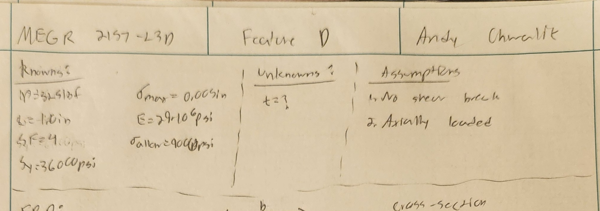
   
   <em>Figure #13: Knowns and unknowns for feature D</em>

    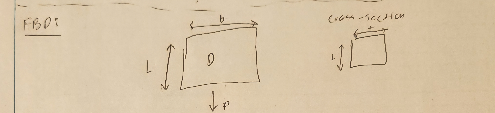
   
   <em>Figure #14: FBD for feature d.</em>

Feature D reminded me a lot of how feature B was calculated, so I decided to use the same method as before. I found the area, and would later calculate the thickness when drawing the detailed sketches.

    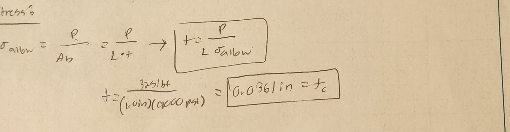
   
   <em>Figure #15: Feature D stress analysis.</em>

#### Feature E

There was no hints for feature E, so I drew it as I saw it in Figure #1.

    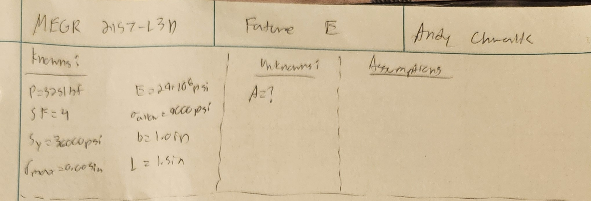
   
   <em>Figure #16: Knowns and unknowns for feature E.</em>

    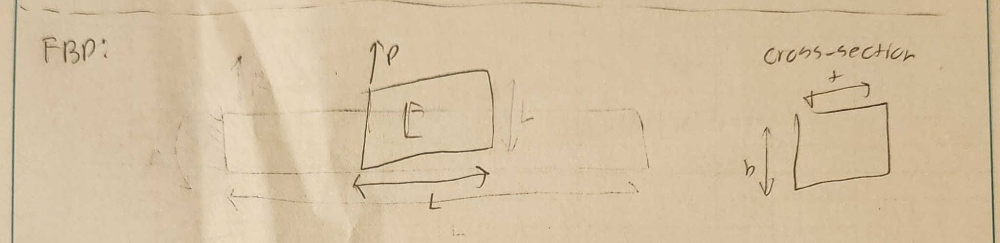
   
   <em>Figure #17: FBD for feature E.</em>

Similar to how feature D reminded me of feature B, feature E reminded me of feature C. They had the same knowns and unknowns, so I just used the same equations as from feature C, but with my new dimensions for feature E.

    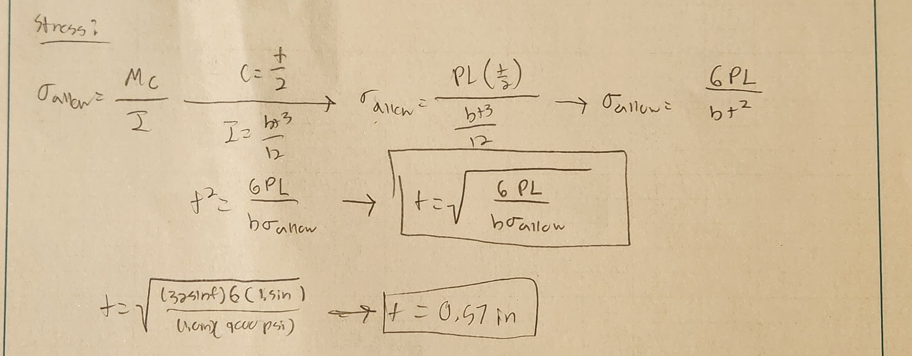
   
   <em>Figure #18: Feature E stress analysis.</em>

#### Stress Analysis MultiView Sketches

It was at this step where i really found out how messed up my dimensions actually were. I did the stress analysis and stiffness analysis before drawing the multiview sketches, and I was incredibly confused on how I was supposed to draw it. Based on my FBDs, it looks like every part has a different thickness, which makes it look very different from the original part. With that in mind, I still used my found values with what is supposed to be the correct multiview sketches.

    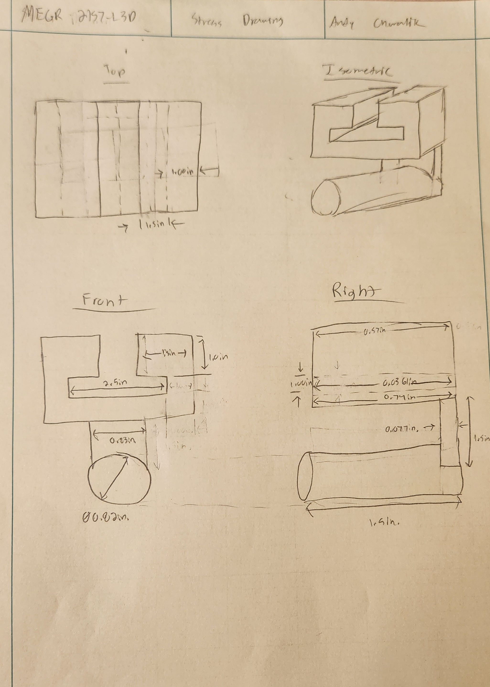
   
   <em>Figure #19: Multiview sketches for stress analysis.</em>

### Stiffness

I followed the exact same steps as for stress analysis, but using stiffness. I used the same FBDs and knowns and unknowns as I did from stress analysis, so I don't see a need in showing those same figures twice in a row. I am also solving for the exact same variable as I did for stress analysis, so there is no explanation needed for why I am solving for anything. So I am going to show just my work for this section of calculations.

#### Feature A

    
   
   <em>Figure #20: Feature A stiffness calculations.</em>

#### Feature B

    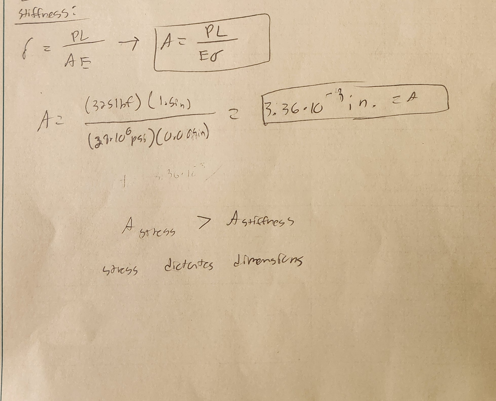
   
   <em>Figure #21: Feature B stiffness calculations.</em>

#### Feature C

    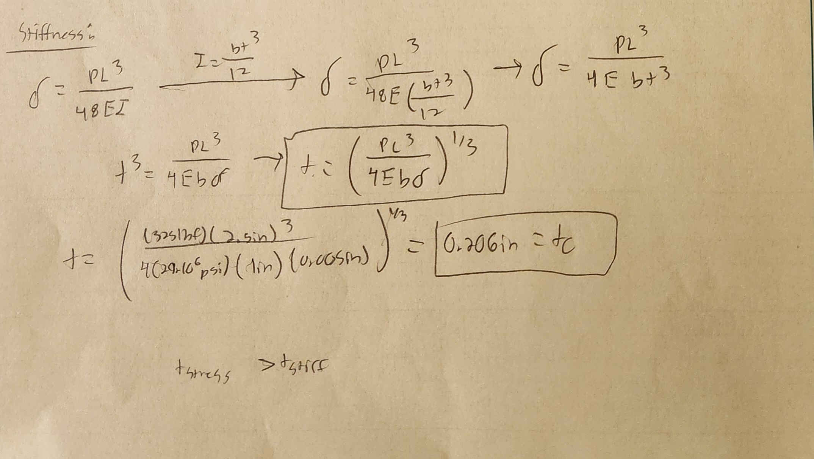
   
   <em>Figure #22: Feature C stiffness calculations.</em>

#### Feature D

    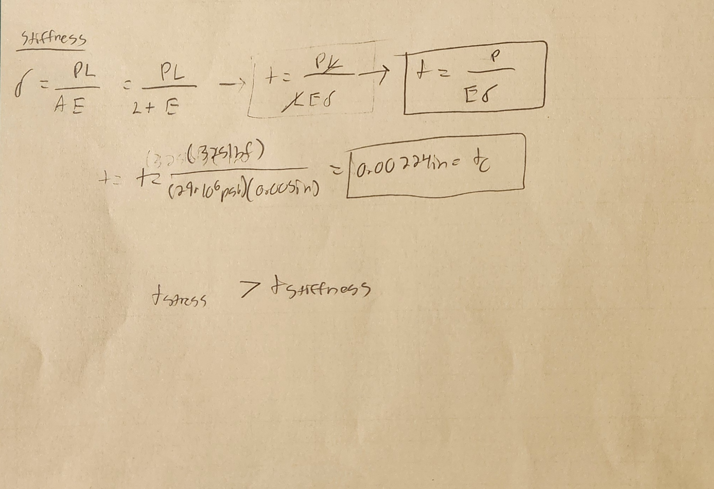
   
   <em>Figure #23: Feature D stiffness calculations.</em>

#### Feature E

    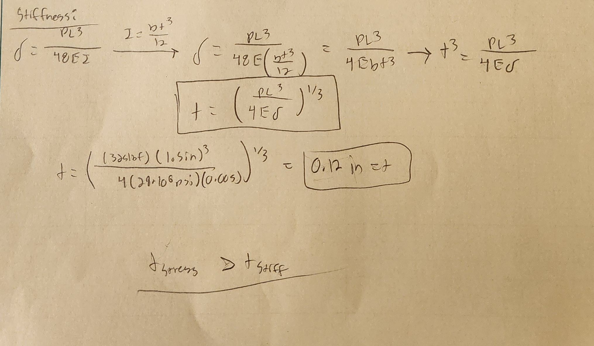
   
   <em>Figure #24: Feature E stiffness calculations.</em>

#### Stiffness Multiview Sketches

Similar to the stress analysis, I defintely knew my final dimensions were incorrect. I matches my dimensions to the sketches the best I could though.

    
   
   <em>Figure #25: Multiview sketches for stiffness calculations.</em>

