# A6 – Bracket Drawing

## Objective

The goal of this assignment is to take the dimensions calculated from A05 and apply them to CAD software. I will have to parametrically model my bracket and then create a drawing of it afterwards. Doing so should teach me the standards for drawing and to improve my CAD skills.

## Analyze

### Redesign

My dimensions for the previous assignment were really bad, so I decided to recalculate all of the dimensions for my bracket. This is not a redo of A05, so I will just be doing the calculations of the features. I will be referencing the FBD's from A05, but I will not redraw them as they are still the same.

#### Feature A

The main thing that messed up my calculations the first time was not properly understanding the dimensions. I used the t-bar to help find the diameter, but that doesn't make any sense. The only real unknowns for feature A is the length and diameter. I used the same formula as I did in A05, but I left the length as an unknown variable. I then plugged in values for the length until I got a length that I liked. I calculated stress and stiffness, however stress is still the dominating force. When plugging in values for the length, I made sure that the stress that was created was not greater than our allowed stress. 

    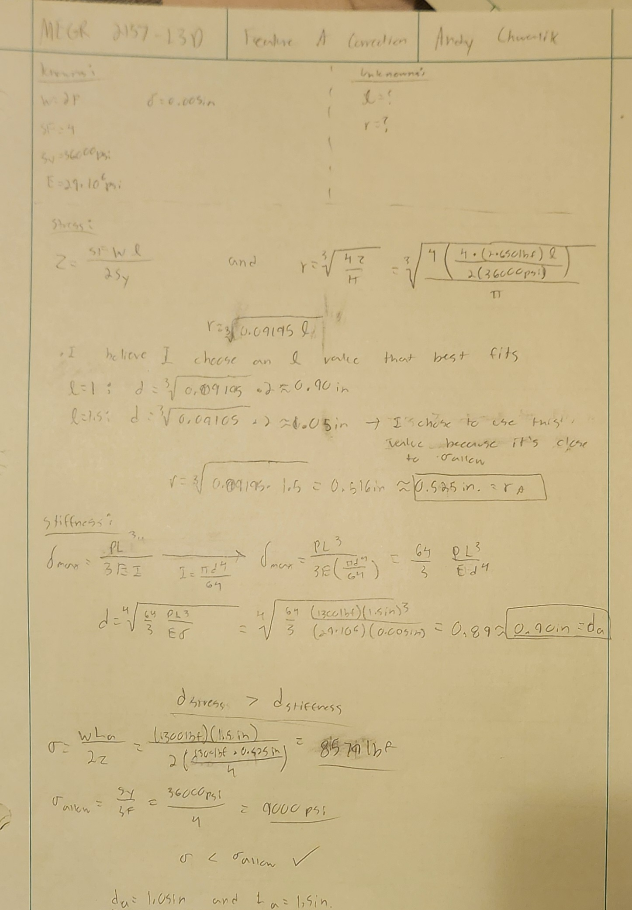

When I calculated the diameter, I calculated around 1.03in. I wanted to round to 1.00in, but my stress would've been greater than the allowed stress. This is why I had to use 1.05in instead. It allowed me to be just under the allowed stress. 

#### Feature B

As I mentioned in my lessons learned in A05, the width/base of feature B should be the same as the diameter of feature A. Even though I know the width, I still have two unknowns: height and thickness. I labeled the height as length because I decided to make it the same value as the length for feature A. There wasn't a specific reason for it, but I just wanted to use common values. Giving feature B a height allowed me to find the thickness.

    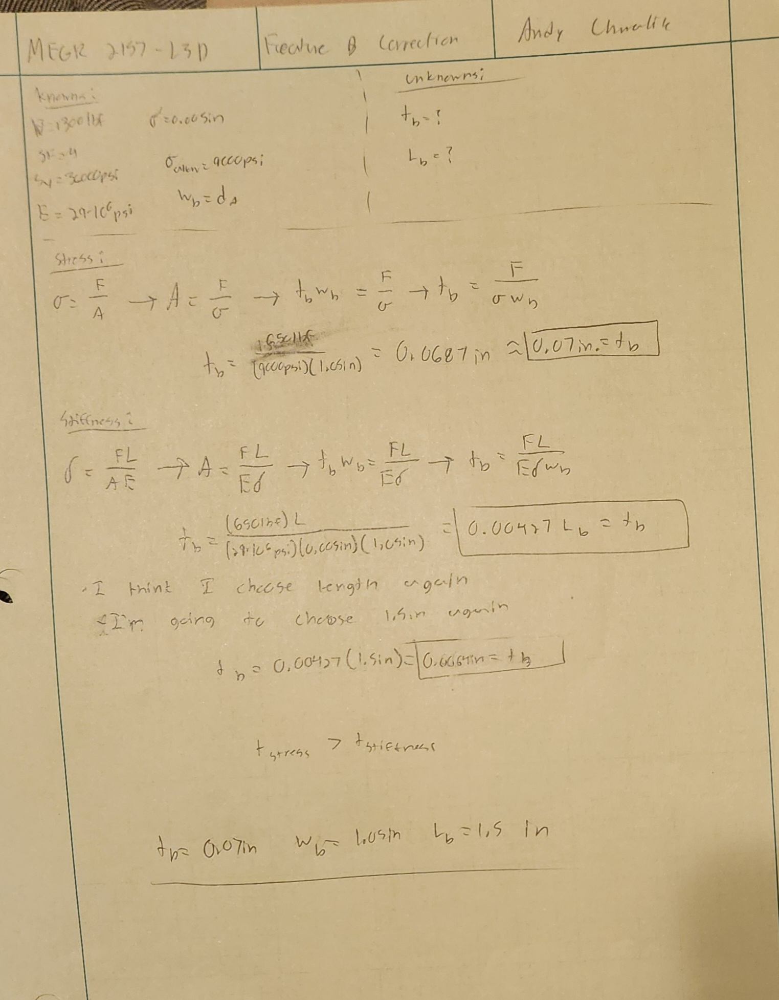

My calculated thickness for both stiffness and stress is really thin, but I think it should still work.

#### Feature C

I finally understood how to apply the t-bar to this design. I can see that the base of the t-bar should be the base/width of the t-bar diagram. That means the base would be 2*b + a from the t-bar diagram. That gave me a value of 2.4964in. To calculate the thickness of the figure, I had to find a length that I could use once again. When I redid this, I decided to make it the same length as feature A. In hindsight, I should've made it smaller because it doesn't really make sense for them to be the same if feature A will be sliding into a link, but that's what I am using for this model.

    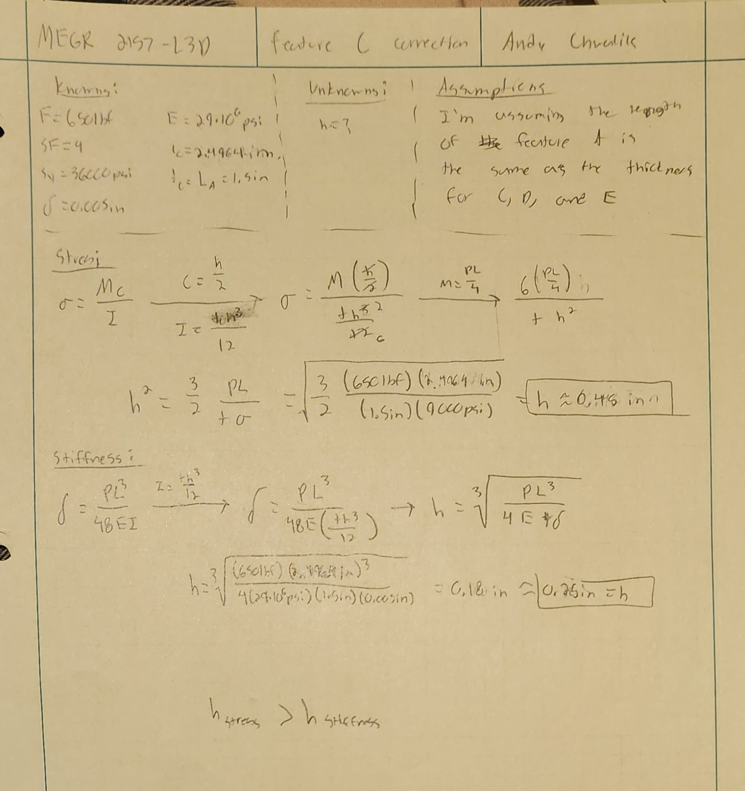

#### Feature D

Feature D is associated with the length I dedicated to feature C since they appear to be the same length from the original picture shown. Using this length value, and the c values from the t-bar, I am able to calculate the height of feature D.

    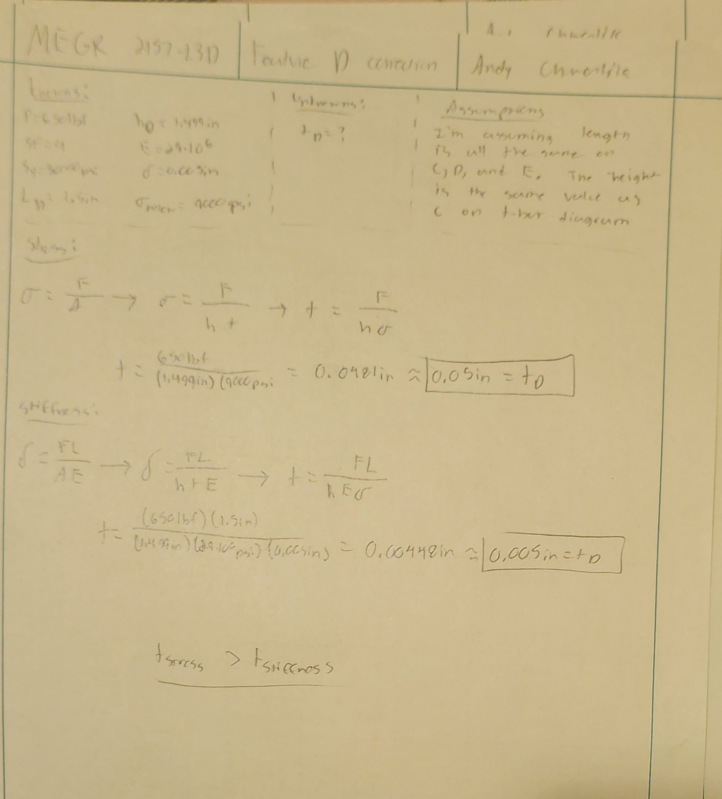

It is extremely thin compared to the rest of the part, but the original dimensions from the t-bar don't really look to scale. Knowing this gives me a little more confidence about the design than the first time I did these calculations.

#### Feature E

As mentioned before, feature D, feature C, and feature E are all linked together. This means that the length of feature E will be 1.5in to keep their association with each other. I can also use the last value in the t-bar diagram for the base of feature E. Knowing both of these values will allow me to calculate the height of feature E.

    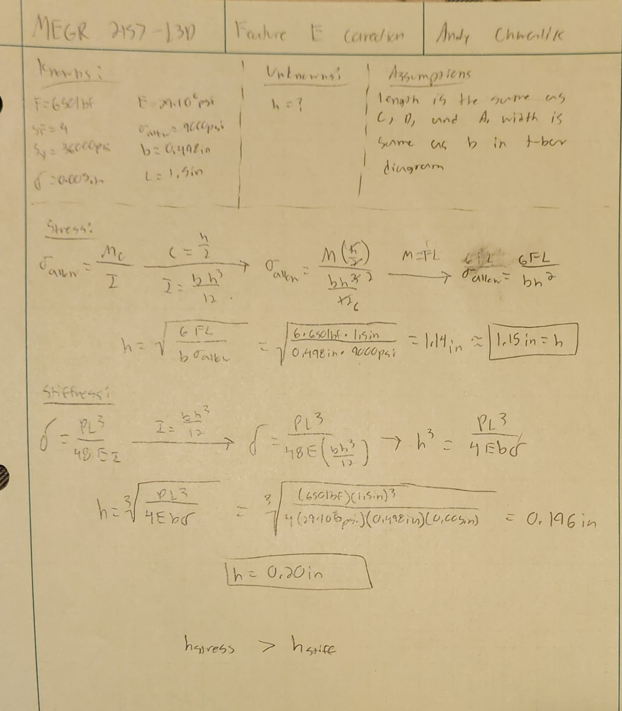

I feel much better about these calculations even though the final design won't look exactly like the design shown to us. If I were to do this a third time, I think I would use the a and b values from the t-bar diagram to find the base/width of feature D. This will make my design look very similar to the drawing. There isn't any stress analysis with this strategy though.

#### Stress Dimensions

My entire design is dictated by stress, so I decided to make my drawings with my stress calculations. I realized I over dimensioned my previous drawing in A05, so I made sure that I had just enough dimensions to fully design the feature. I found out that the most distinct feature in this design is the front. I felt like I had to put a lot of dimensions on the front view because it is not very accepted to look at dimensions from hidden lines on a real drawing. I guess I could do section views, but that seems unnecessary for the scale of this project.

    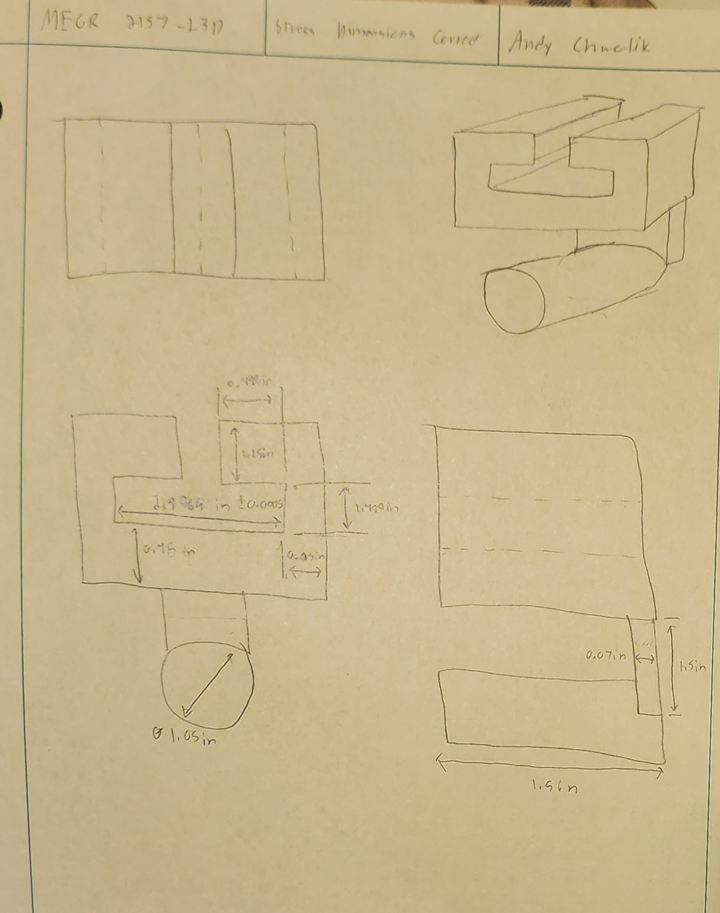

### CAD Modeling

Now that my dimensions are defined, and I feel better about them, I can actually work on the objective for A06. To start my 3D design I created an equation sheet, so I can parametrically design my CAD design. I inputted all of my calculated values from my new redefined design, including the mechanical properties of ASTM A36 Steel. I made sure to make dimensiosn related to each other rather than typing in individual values for each other.

    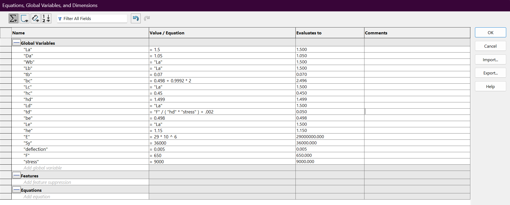

<table style="width:100%;">
  <tr>
    <td style="width:60%;">
      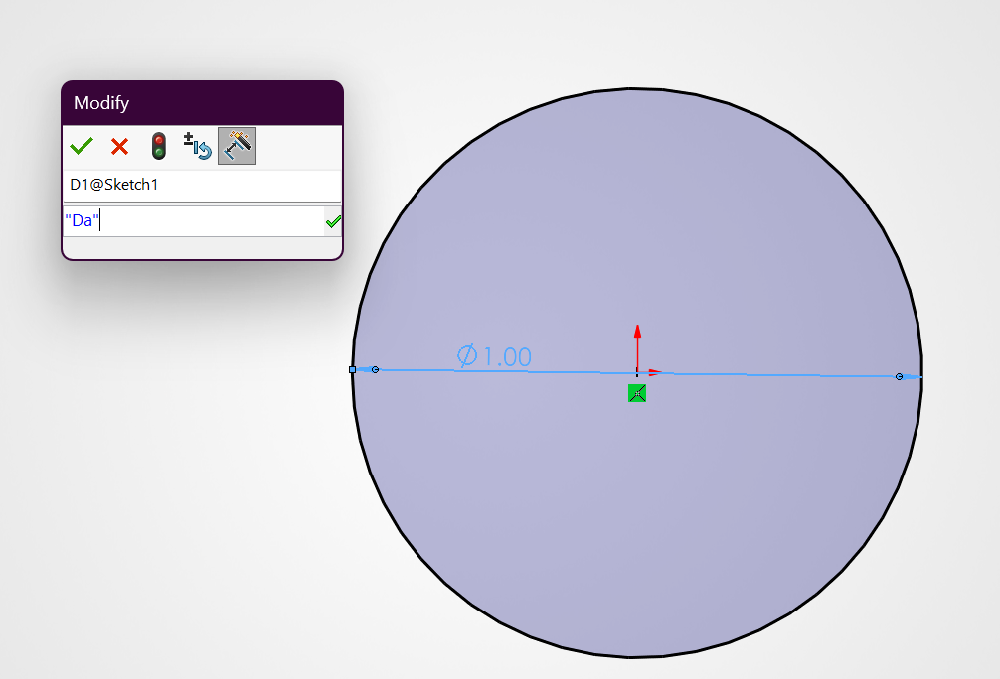
    </td>
    <td style="width:40%; padding:28px; text-align:center; vertical-align:middle;"">
      

        Once I had my dimensions defined, I started to work on the actual model. I decided to start with feature A first since that was the first feature I worked on when calculating the dimensions of the entire design. To do this I created a circle, and then set the dimension of that circle equal to the global variable for the diameter for feature A.
      

    </td>
  </tr>
  <tr>
    <td style="width:60%;">
      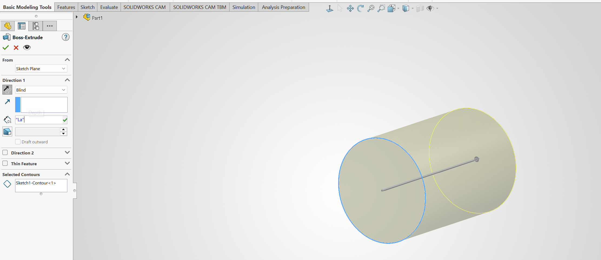
    </td>
    <td style="width:40%; padding:28px; text-align:center; vertical-align:middle;"">
      

        I then extruded the sketch I created by the global variable set for the length of feature A, completing feature A.
      

    </td>
  </tr>
  <tr>
    <td style="width:60%;">
      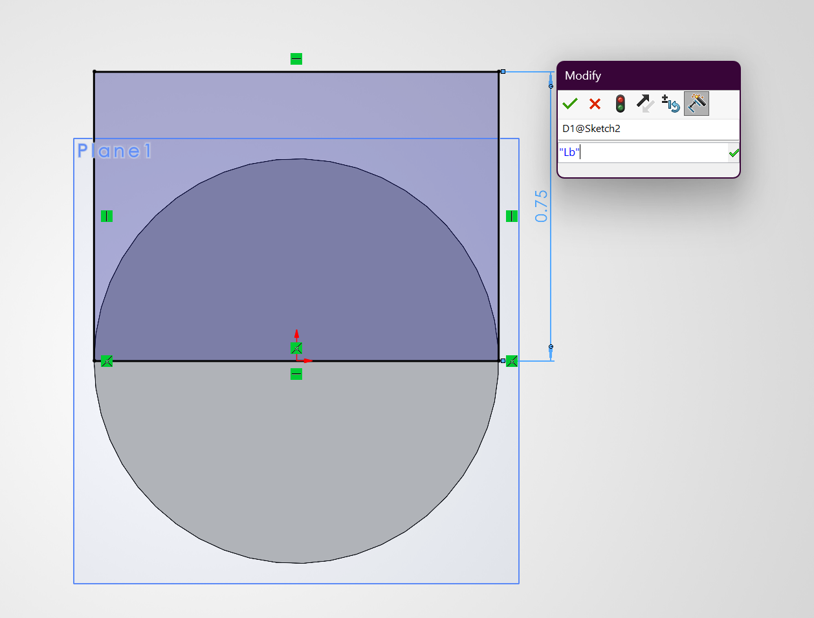
    </td>
    <td style="width:40%; padding:28px; text-align:center; vertical-align:middle;"">
      

        To create feature B, I created a box that starts from the halfway point on feature A. That is where it looked like it started in the model shown, so that was one of the assumptions I made. Since the width/base of feature B is already defined by the diameter, I defined the height using the global variable for feature B's height, finishing the sketch.
      

    </td>
  </tr>
  <tr>
    <td style="width:60%;">
      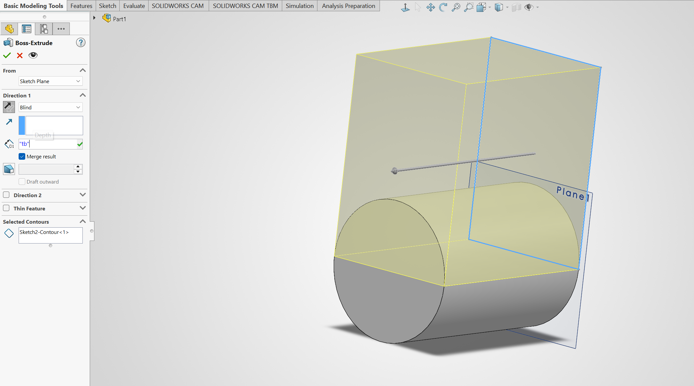
    </td>
    <td style="width:40%; padding:28px; text-align:center; vertical-align:middle;"">
      

        Since the sketch was on the backside of feature A, I extruded the sketch in the direction of feature A using the global variable for the thickness of feature B. This finished the design for feature B.
      

    </td>
  </tr>
  <tr>
    <td style="width:60%;">
      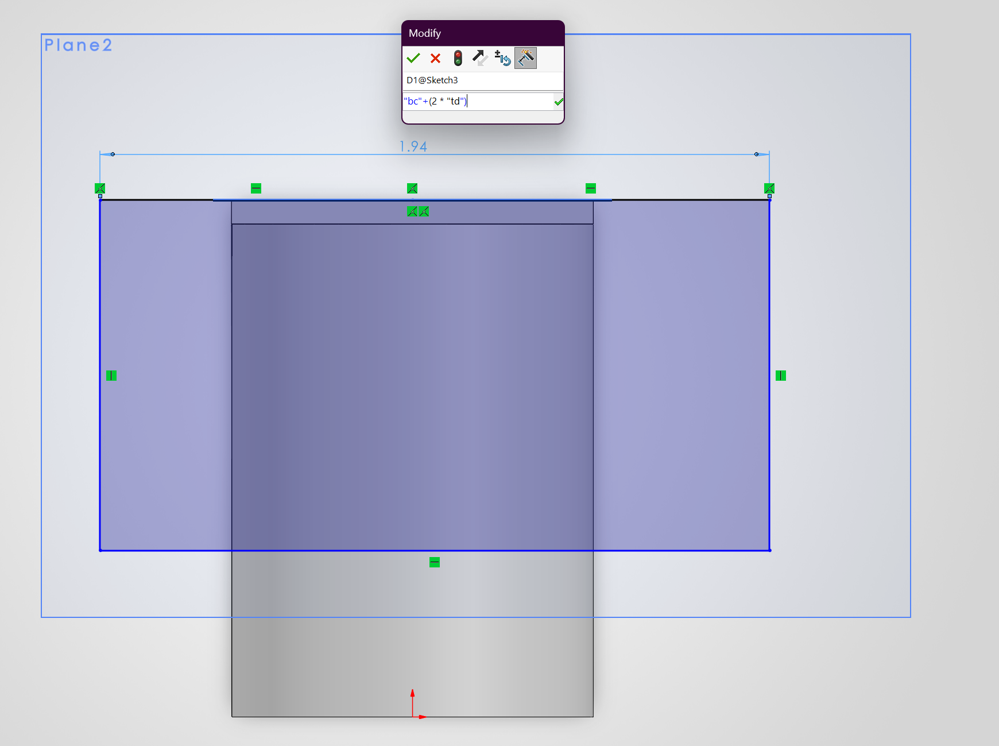
    </td>
    <td style="width:40%; padding:28px; text-align:center; vertical-align:middle;"">
      

        I created a plane on top of feature B so that I can start modeling feature C. I created a box on this plane, and then assigned the base/width of feature C with the respective global variable. I also made sure to add the thicknesses of feature D onto this since my length only relates to the distance from wall to wall. My box wasn't centered after doing so, so I made sure that everything was centered by using centerlines.
      

    </td>
  </tr>
  <tr>
    <td style="width:60%;">
      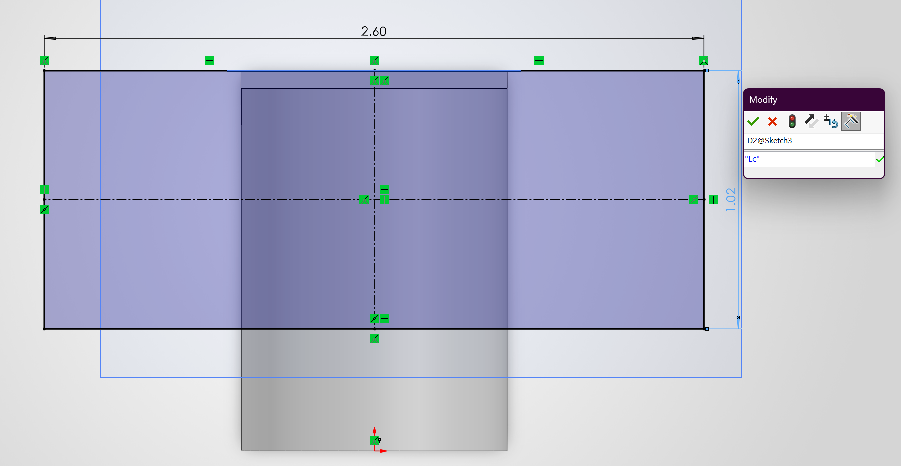
    </td>
    <td style="width:40%; padding:28px; text-align:center; vertical-align:middle;"">
      

        The only other thing to define before extruding was the length, so I assigned the respective variable for the length of feature C.
      

    </td>
  </tr>
  <tr>
    <td style="width:60%;">
      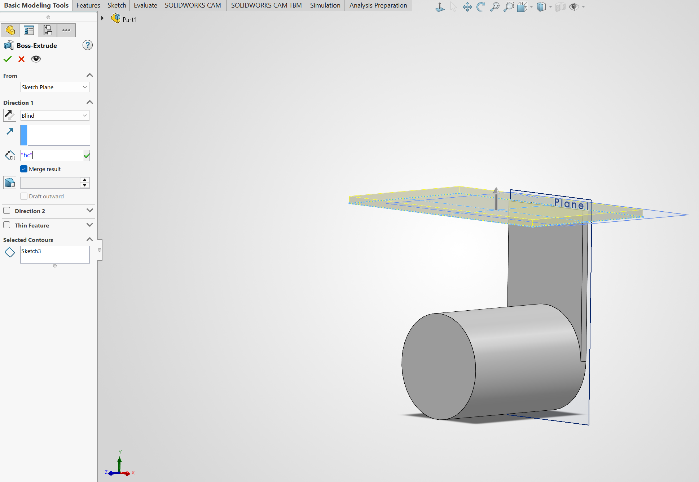
    </td>
    <td style="width:40%; padding:28px; text-align:center; vertical-align:middle;"">
      

        To finish feature C, I extruded it using the thickness variable I calculated from my redesign.
      

    </td>
  </tr>
  <tr>
    <td style="width:60%;">
      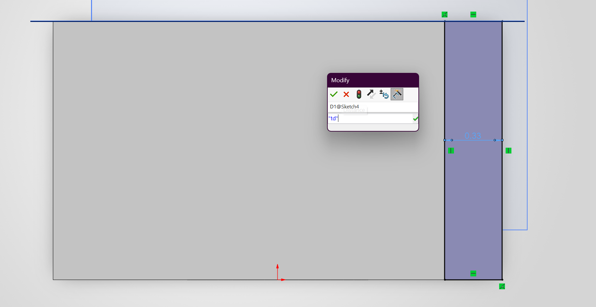
    </td>
    <td style="width:40%; padding:28px; text-align:center; vertical-align:middle;"">
      

        To create feature D, I created a box that spanned the length of feature C. I then defined the thickness by using the respective variable.
      

    </td>
  </tr>
  <tr>
    <td style="width:60%;">
      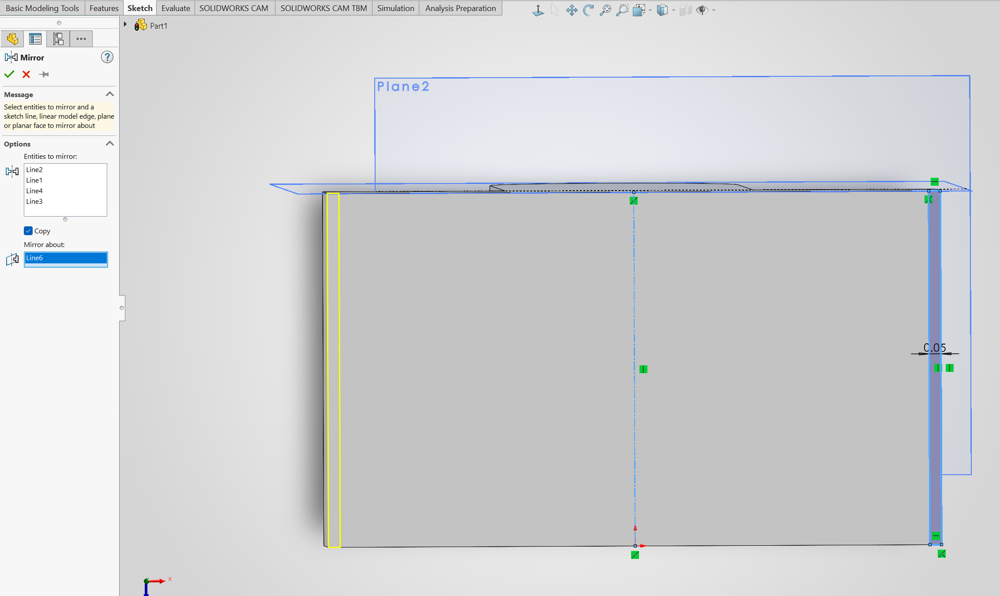
    </td>
    <td style="width:40%; padding:28px; text-align:center; vertical-align:middle;"">
      

        Rather than repeating the process on the other side of the model, I placed a centerline in the middle of feature C. I then mirrored my sketch to the other side of feature C.
      

    </td>
  </tr>
  <tr>
    <td style="width:60%;">
      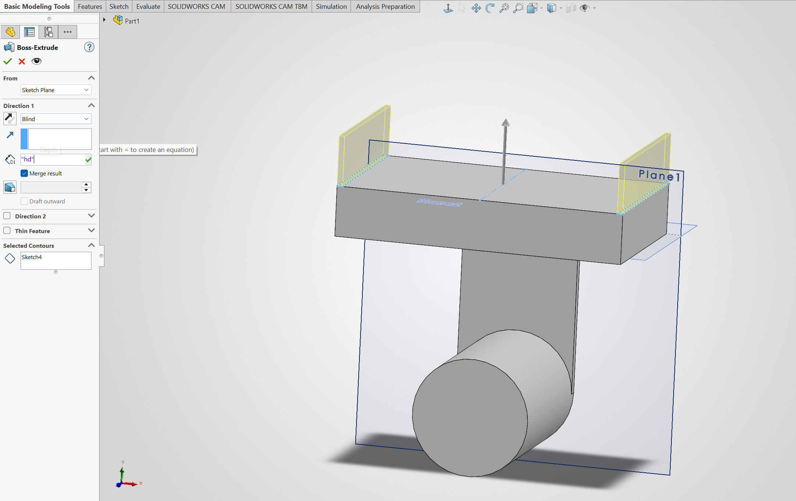
    </td>
    <td style="width:40%; padding:28px; text-align:center; vertical-align:middle;"">
      

        To finish feature D, I extruded my sketch by using its respective variable.
      

    </td>
  </tr>
  <tr>
    <td style="width:60%;">
      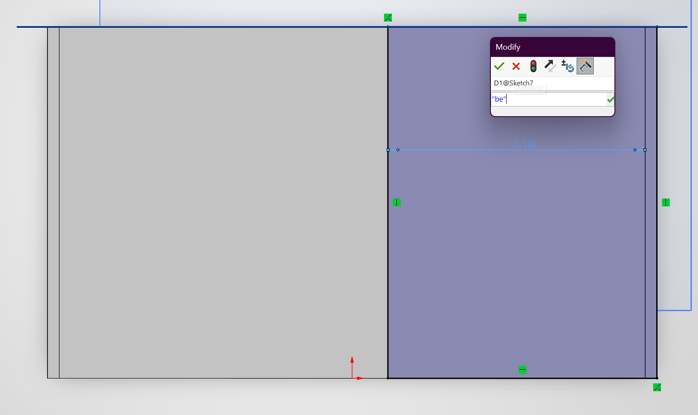
    </td>
    <td style="width:40%; padding:28px; text-align:center; vertical-align:middle;"">
      

        Sketching feature E, I made another box from top to bottom of feature D. I then defined the base/width of feature E by measuring the far left edge to the first edge of feature D. I assigned this value with its respective variable.
      

    </td>
  </tr>
  <tr>
    <td style="width:60%;">
      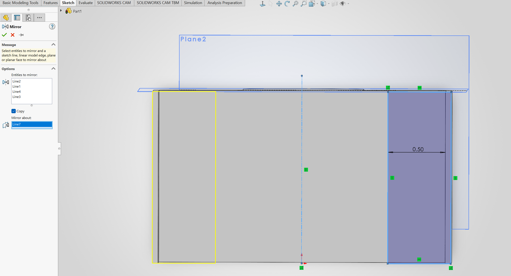
    </td>
    <td style="width:40%; padding:28px; text-align:center; vertical-align:middle;"">
      

        Feature E is also symmetrical about the middle of the design, so I used the same technique of mirroring my design about a centerline.
      

    </td>
  </tr>
  <tr>
    <td style="width:60%;">
      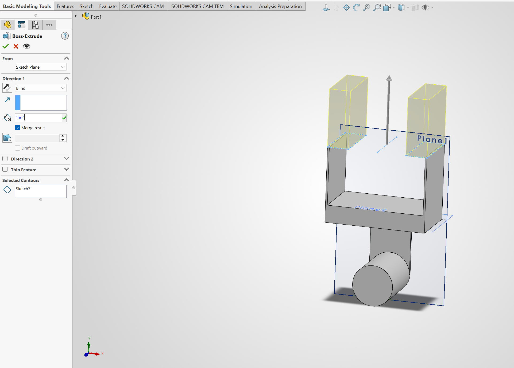
    </td>
    <td style="width:40%; padding:28px; text-align:center; vertical-align:middle;"">
      

        To finish my design, all I did was extrude feature E by its respective variable.
      

    </td>
  </tr>
</table>

When I finished modeling my design, I was happy that it has a similar shape to the design given, but I was still slightly annoyed that my design looked off compared to other students. I think the results are way better than what I had in previously in A05 though, so it should work just fine. If you are curious on any step in my CAD design, here is the [CAD file](bracket.SLDPRT).

### CAD Drawing

When I created the drawing, I couldn't see any drawing sheets with title blocks unless I unchecked the only show standard forms box. Once I did this, I decided to use the A (ANSI) Landscape drawing sheet. 

    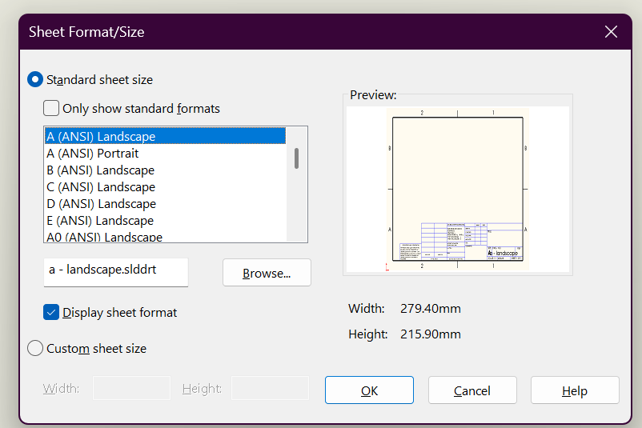

When I first made the drawing sheet, I had to select the file I wanted to use for the drawing sheet. My bracket file was already selected since I created the drawing sheet from the CAD file. The first view I placed was the front view. Once I placed the front view, I was able to move my cursor to the top to get the top view, to the right to get the right view, and then to the top right to get the isometric view.

    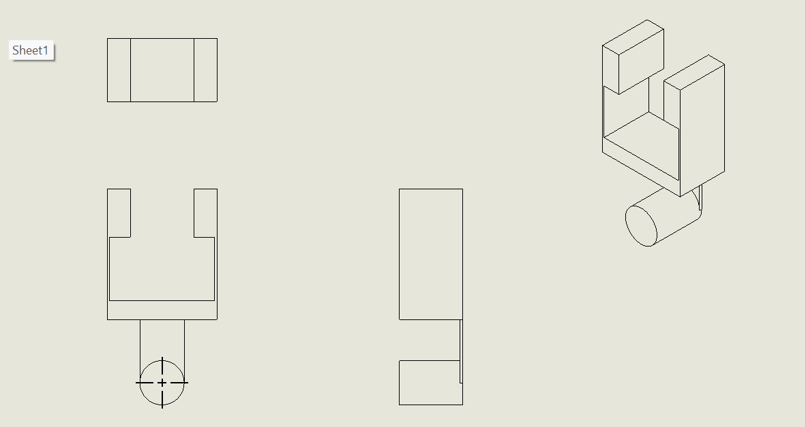

Once my views were down, I started assigning dimensions to the different views. I tried to follow my sketched out drawing, but the varying values made it hard to do so in some areas. An example would be the heights and thickness of features C, D, and E. This process wasn't very difficult since all of the values were already on the CAD file.

    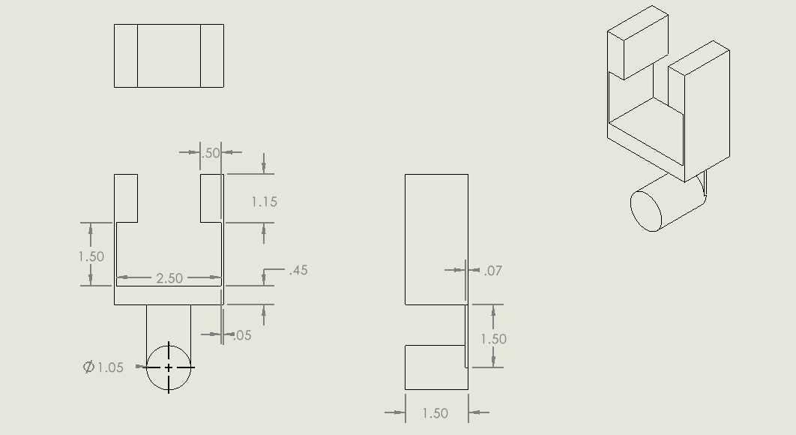

After, I started working on the title block. This was my only drawing, so it is my first drawing. I named the drawing bracket since that is the assignment name. I made sure to say that I designed it. I also made sure to put in the tolerances that were mentioned inside the assignment. I did say that it was property of UNC Charlotte, but I am not sure if that is correct or not since I created the drawing. The prompt said to put the companies name, so that is why I put UNC Charlotte. For the ANSI standards symbol, I couldn't figure out how to input it inside the drawing, so I took a screenshot of the ANSI third projection symbol and inserted it into my drawing.

    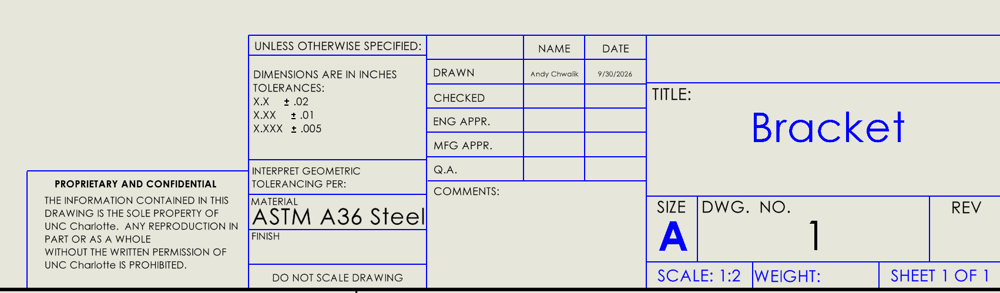

My drawing wasn't done because I needed to add the hidden lines to the different views. I had no idea how to do this, and it took my an embarrassing amount of time to figure it out. All I had to do was click on the view, and then click on the show hidden lines square in the "Display Style" options. 

    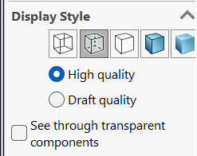

With the addition of the hidden lines, and checking to make sure I am using ANSI standards, my drawing and CAD model are completed. If you want to explore my drawing sheet further here is the [drawing file](bracket.SLDDRW)

    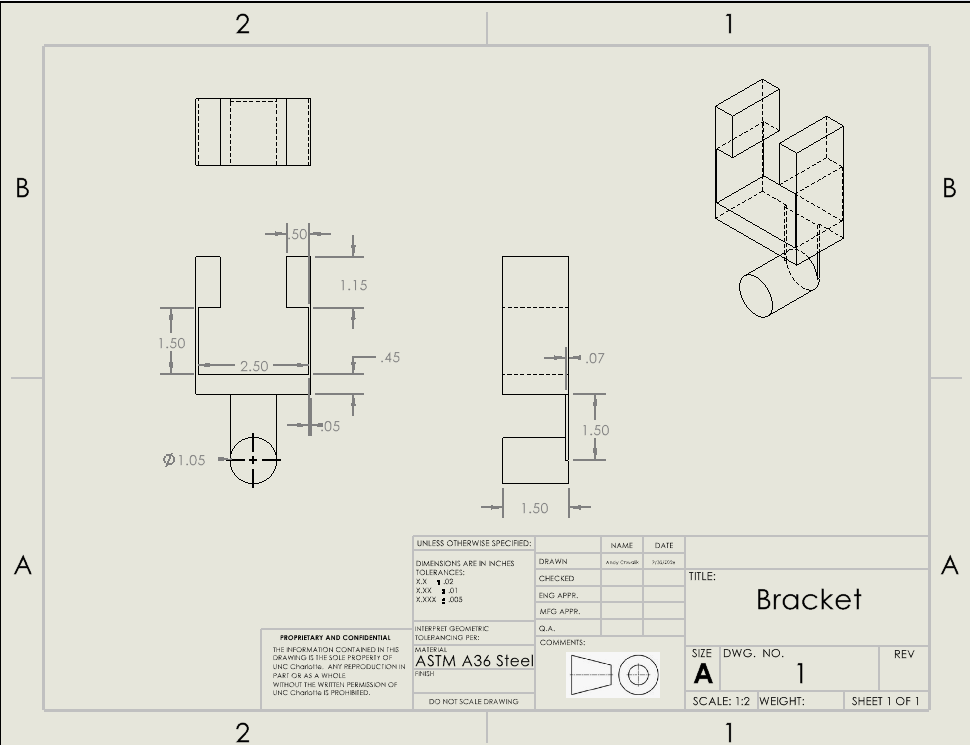

### Reflection

## 2157 Only

### Calculations

For this part of the assignment, I was supposed to do the same thing for the link. Since I didn't add my calculations for that part with my new numbers, here is a picture of it.

    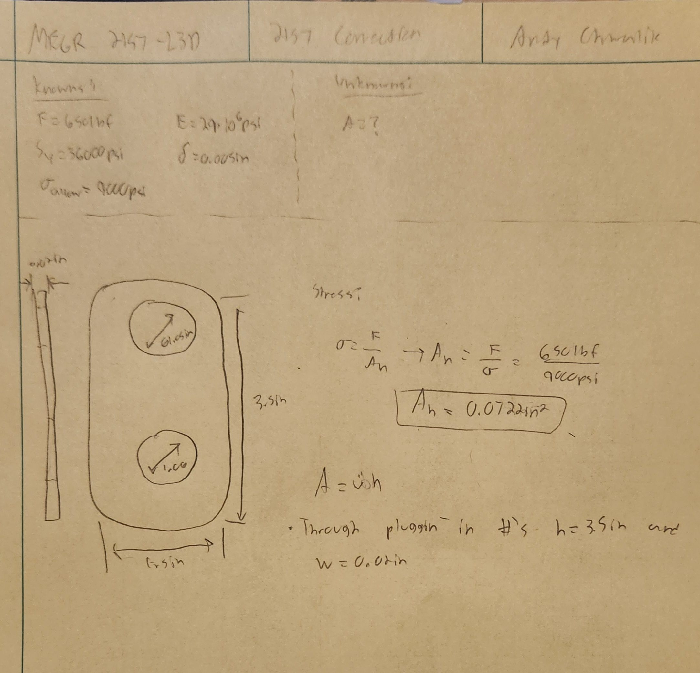

### Cad Modeling

I followed the same steps as when I made the main part. I started off with creating a global variable for all of my mechanical properties.

    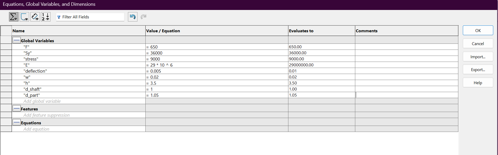

I then used these variables to create a sketch of the link. I wasn't sure how much the edges were curved, so I just picked 0.5in. 

    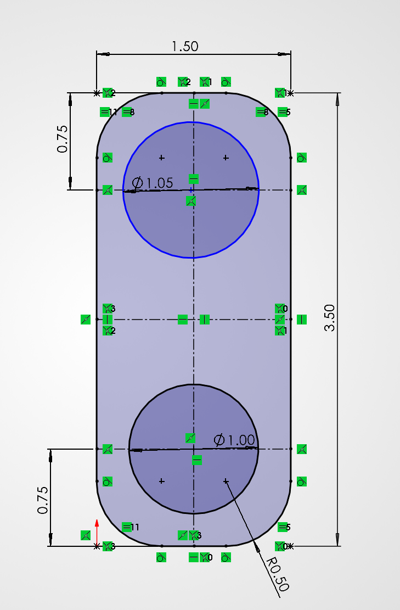

When I had the only sketch for this part of the project down, I extruded it to what my width value was that I calculated.

    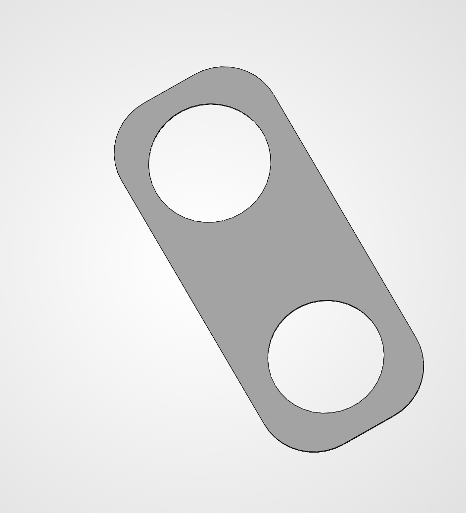

### Drawing

Now that I had all of my values I can move onto the drawing. I followed the exact same process for my first drawing, but I had to add at least two dimension with specific tolerances on them. I decided to put the tolerances on the thickness of the link and the diameter for the hole that is linking the two parts. I chose the thickness of the link because it is incredibly thin already, and there isn't much more material to give up. That is why it is super precise. I chose the diameter of the hole because I have already had a lot of issues in lab with fitting parts together when the dimensions are too close. I don't want that same experience when machining these parts.

    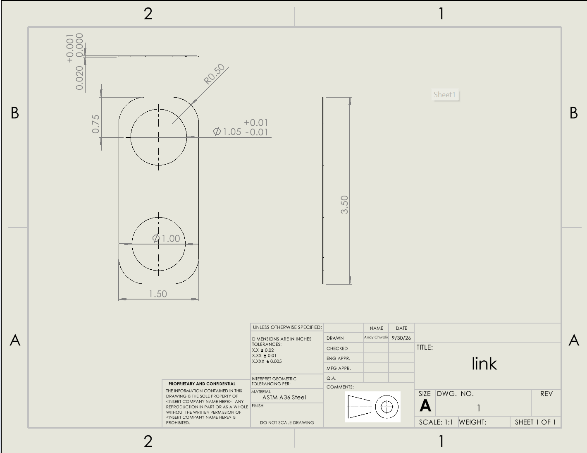

### Reflection
